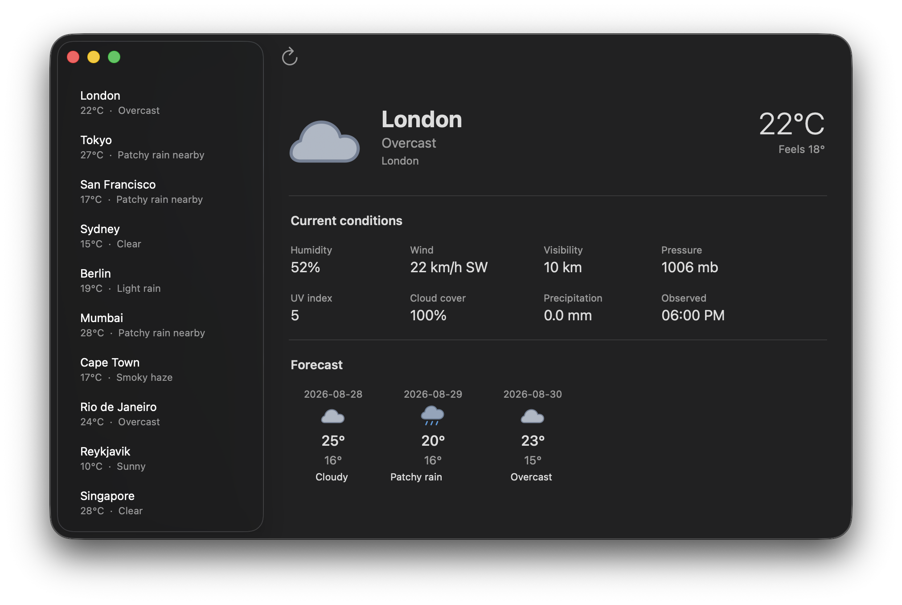

# lua-objc

SwiftUI-style declarative UI written in Lua, rendered by native AppKit or
UIKit controls. Lua apps launch instantly — no Xcode build step, no
compile/run cycle per change.

## Why lua-objc

**SwiftUI is fast for humans but slow for agents.** Every structural change
triggers a full recompilation. A dozen iterations means a dozen Xcode builds.
This is not just theoretical. The tooling pain is widely discussed online:

> "Literally every time I make a change the SwiftUI previews break, requires me
to restart, and give unexpected errors..." — Reddit, r/iOSProgramming
>
> "The preview canvas crashes more than it works." — Reddit, r/SwiftUI
>
> "The Problem: Full app builds take 30+ seconds. That latency kills the
feedback loop." — Reddit, r/SwiftUI
>
> "In reality, the process would take minutes and simulator often stuck in black
screen... I can go on and on about how slow SwiftUI preview is." — Reddit,
r/iOSProgramming

The same theme appears on Stack Overflow and Xcode discussions: builds stall,
previews lag, and simulator startup is flaky enough to break the feedback loop.
lua-objc decouples the app from the toolchain: edit an etlua template or Lua
controller, hit run, and the native window updates instantly. The same code
renders NSTextField on macOS and UILabel on iOS without platform conditionals.

**Agents need testable architecture, not screenshots.** Apps built with
lua-objc follow a strict separation:

```
Model.lua         — pure data, queries, mutations  (headless-testable)
Controller.lua    — wires model → views, owns actions
views/*.etlua     — declarative XML templates
```

Every layer is testable in under a second — no windows, no pauses.
Controllers are instantiated, models are queried, views are rendered and
inspected. Headless tests provide a fast feedback loop alongside visual QA.

**Layout is data, not pixels.** The native layout dump is an XML export of
the entire AppKit/UIKit view hierarchy with computed frames, intrinsic sizes,
text geometry, and explicit `cropped`/`ellipsis`/`outsideParent` flags:


```sh
./lua-objc --dump-layout=/tmp/layout.xml examples/stocks/init.lua

# Capture only the live AppKit content view from inside the process.
./lua-objc --internal-screenshot=/tmp/content.png examples/stocks/init.lua
rg -n 'cropped="true"|outsideParent="true"|contentClipped="true"' /tmp/layout.xml
```

An agent reads the XML to verify alignment, truncation, overflow, and column
widths directly — no image recognition or pixel diffing required. The dump
proves that every label fits, every cell isn't cropped, and every divider
aligns before a human ever sees the screen.

## Quick start

Requirements: macOS 26 or later and Lua 5.4. iOS builds also require Xcode
with the iPhone Simulator SDK.

```sh
make
make test
make run ARGS="examples/hello"
make run-ide

# Or directly (directory path auto-discovers init.lua):
./lua-objc examples/hello
./lua-objc examples/mail
```

iPhone Simulator (host is a runtime; Lua and assets stream from a Mac packager). After the host exists, a save reloads the app **in place** — the process does not quit:

```sh
export DEVELOPER_DIR=/Applications/Xcode.app/Contents/Developer
make ios-run ARGS=examples/hello
# watch Xcode’s Simulator window (not the terminal)
# edit examples/hello/views/Window.etlua, save — UI updates without quitting
```

See [`docs/ios.md`](docs/ios.md) for the host, packager protocol, and coverage contract.

## Weather app example

This is the current best reference for the product story: a real app built with native AppKit controls, declarative Lua, custom SVG artwork, and cross-platform XML templates — without recompiling the app or touching Xcode.



See [docs/weather_app_example.md](docs/weather_app_example.md) for the full walkthrough.

The [weather example](docs/weather_app_example.md) demonstrates asynchronous
HTTP, native loading state, selection-driven detail views, and the current
framework gaps around declarative table row schemas.

Agent-facing documentation is published from [`docs/`](docs/index.md): start
with the [agent quickstart](docs/agents/quickstart.md), then use the
[XML syntax reference](docs/agents/xml-syntax.md) and [Apple UI checklist](docs/agents/apple-ui-checklist.md)
when generating an app.

Capture an app's native content and computed layout:

```sh
./lua-objc --internal-screenshot=/tmp/content.png --width=800 --height=600 \
  examples/layout/init.lua

# Dump AppKit's computed native hierarchy, frames, and table-cell cropping.
./lua-objc --dump-layout=/tmp/layout.xml examples/stocks/init.lua
```

`--preview` is a separate synchronous path for scripts returning a native
view; it does not instantiate the Controller class returned by an app entry
point. See [preview behavior](ARCHITECTURE.md#--preview-cli-mode).

## Where to work

| Task | Start here |
|---|---|
| Maintain native framework `.m` code | `skills/maintain-lua-objc-framework/SKILL.md`, then `src/README.md` |
| Add or compose a Lua widget | `lua/embedded/AppKit.lua` |
| Add a macOS native bridge primitive | `src/README.md`, then the matching `src/appkit/*.m` fragment |
| Change flex layout | `src/appkit/layout.m` |
| Change lists or outlines | `src/appkit/table_data_source.m`, `src/appkit/outline_data_source.m`, `src/appkit/controls.m`, `src/appkit/outline.m`, `docs/tableview_swiftui.md` |
| Change async state ownership, HTTP, timers, or JSON | `src/shared/lua_async.m` |
| Change CLI preview rendering | `src/main.m`, `src/appkit/platform.m` |
| Change editor highlighting | `src/appkit/syntax_highlight.m` |
| Add an IDE editor surface | `examples/ide/` |
| Write or modify XML view templates | `lua/ui/xml.lua`, `examples/<app>/views/` |
| Use template inheritance or partials | `views/AppWindow.etlua`, `views/partials/` |
| Add a new example app | `examples/<app>/init.lua`, `AGENTS.md` (MVC layout rules) |
| Change app startup or recents | `lua/App.lua`, `examples/ide/` |
| Add UIKit coverage | `src/uikit/`, `src/uikit_module.m`, `lua/embedded/UIKit.lua` |
| Run on iPhone Simulator / in-process reload | [`docs/ios.md`](docs/ios.md) |
| Understand runtime ownership | `ARCHITECTURE.md` |
| Look up the Lua API or bridge rationale | `docs/PROJECT_REFERENCE.md` |
| Research Xcode parity | `docs/research/XCODE_UI_ARCHITECTURE.md` |

Search for the symbol you need instead of loading a whole subsystem:

```sh
rg -n 'bridge_tableview|List' src lua tests docs
```

## Architecture

```text
App: Model + Controller + views (etlua templates and partials)
                         |
            Public AppKit.lua / UIKit.lua API
                         |
            Native platform bridge and layout
                         |
                 AppKit / UIKit controls

Shared native services: userdata conversion, Lua state lifetime, async, errors
```

On macOS, `src/host.c` loads `build/AppKit.dylib`, which contains the runtime
and embedded public Lua API. On iOS, `ios/LuaRuntime/` links the UIKit runtime
and streams the public Lua API and app sources from the packager.
`build/UIKit.dylib` is the SDK compile-check, not the Simulator app.

### Who owns an object: Lua or ARC?

**Lua owns the userdata handle; the handle holds a strong native reference.**
`push_objc` stores a `CFBridgingRetain` in `ObjCRef.ptr`. Lua's `__gc` calls
`gc_objc`, which balances it with `CFRelease`. ARC manages native strong
references outside that explicit bridge boundary. See the
[shared implementation](src/shared/lua_bridge_support.m).

| Resource | What keeps it alive? | What releases it? |
|---|---|---|
| Lua model, controller, table, closure | Reachable Lua references, including registry entries | Lua GC after those references disappear |
| Native view or window exposed to Lua | Each userdata handle retains it; native containers and other strong references can also retain it | Userdata finalization releases its retain; native owners release theirs independently |
| Native delegate / data source / layout metadata | A strong property or retained associated object where the bridge installs one | Replacement or destruction of the owning native object |
| Lua callback installed in native code | A Lua registry reference; an integer on the native object identifies it | Explicit `luaL_unref`, or state teardown; cleanup is not yet uniform across controls |
| `lua_State*` | A closing `LuaStateOwner` on macOS; `LRTApplicationController` on iOS | Explicit `lua_close` by the designated owner; ARC cannot free a C pointer itself |

Setting `view = nil` drops a Lua reference. Collection later releases that
handle's native retain; a parent can still keep the view alive. Conversely,
removing a view from a container does not destroy it while Lua still holds a
handle. Two handles may refer to the same native object; Lua table-key identity
must not be used as native object identity.

Callbacks need particular care: a registry-rooted closure can capture a
controller that retains the callback's view. Lua GC and ARC do not jointly
collect that ownership cycle. Dispose registrations explicitly when their
screen or state ends; a native `dealloc` alone cannot break a cycle that keeps
the native object alive. The language rules are described in the
[Lua GC manual](https://www.lua.org/manual/5.4/manual.html#2.5) and
[Clang ARC specification](https://clang.llvm.org/docs/AutomaticReferenceCounting.html).

### Should all `.m` files live in one folder?

**Keep native files in folders by platform and responsibility.** The file
extension does not define an architectural layer:

| Location | Responsibility |
|---|---|
| `src/appkit/` | AppKit controls, navigation, layout, property and method bindings |
| `src/uikit/` | UIKit equivalents and scene integration |
| `src/shared/` | Common bridge conversion, state ownership, async services, errors |
| `ios/LuaRuntime/` | iOS process lifecycle, source loading, reload, capture |
| `src/packager/` | Mac development server for Lua and assets |
| `examples/<app>/` | Application behavior and composition in Lua |

Nested subsystem folders are fine when they make navigation easier. Use
one shared `.h` per folder that needs cross-file declarations, with the
implementations in separate `.m` files. The iOS host uses `LuaRuntime.h`;
included bridge fragments do not need per-class headers. Preserve
the existing build boundary: `src/main.m` includes AppKit fragments;
`src/uikit_module.m` includes `src/uikit/bridge.m` and its fragments. Included
`.m` files are **not separate compiler inputs**. Add an explicit include when
adding a fragment; Makefile discovery only tracks rebuild dependencies.

One runtime image per platform keeps bridge state and associated-object keys
unique. One image can contain multiple compiled objects; the current included
fragments additionally share translation-unit-local symbols. Moving a file
between folders does not change either boundary. See the
[native source map](src/README.md) for placement and build rules.

### What belongs in Lua, and what belongs in Objective-C?

Keep models, actions, reusable components, and template composition in Lua.
Use Objective-C for native initializers, delegates, platform lifecycle,
rendering, and operations the existing bridge cannot express. Ordinary native
properties use KVC; semantic aliases belong on exported native classes;
non-property operations get explicit bindings. XML is a shared UI vocabulary,
not a second native-property schema.

The current API builds native views eagerly. Lua owns the application state;
native widgets own interaction state, and native containers own their geometry.
The flex engine measures and places framework stacks while respecting those
containers. Mutating a model does not automatically rebuild a view tree.

### What should improve next?

The review identifies these priorities, in dependency order:

1. **Unify callback lifetime.** Replace global-state callback lookup and bare
   registry integers with state-bound registrations and explicit disposal.
   Test callback replacement, collection, cancellation, and iOS reload.
2. **Make state teardown explicit.** Quiesce native event sources and detach
   callbacks before closing or replacing a state. The async owner already
   provides cancellation, but UI callbacks still use `gL` in several paths.
3. **Add retained descriptions and keyed reconciliation.** A renderer should
   own mounting, updates, and unmount cleanup while preserving native focus
   and selection. `lua/ui/viewdesc.lua` can describe/diff trees, but its
   `apply` function is currently a no-op; it is not a working renderer.

These are remaining implementation work, not guarantees of the current
runtime. The [architecture guide](ARCHITECTURE.md) records the evidence,
lifetime contracts, and verification requirements.

### App structure (MVC)

Every app follows the MVC folder layout:

```
examples/<app>/
  init.lua        — entry point, requires and returns Controller class
  Model.lua       — pure data: queries, formatting, sample data
  Controller.lua  — creates views, wires Model → views, owns actions
  views/          — etlua templates only, including reusable partials
```

`init.lua` never self-starts. It returns the class; the framework calls
`class.new():createWindow()`.

### A PHP reference point: Laravel with Blade

Think of lua-objc as **Laravel-style application structure and templates,
rendering real AppKit/UIKit controls, with a persistent native application
lifecycle**. The PHP analogy fits the authoring workflow: application code
prepares data, passes it to a template, and the runtime turns it into an
interface.

| Laravel concept | lua-objc equivalent |
|---|---|
| Controller prepares data and renders a view | `Controller.lua` calls `xml.renderFile(...)` |
| Models and application services | `Model.lua` provides queries, mutations, and fetching |
| Blade templates | `views/*.etlua` |
| Includes, layouts, and sections | `partial()`, `extends()`, `block()`, `yield()` |
| Reusable view components | etlua partials emitting native view trees |
| Routes dispatch actions | Native callbacks invoke controller methods |

The [hello controller](examples/hello/Controller.lua) shows the basic flow:
take model data, render a template, and create a window. The
[mail controller](examples/mail/Controller.lua) adds interaction: selecting
a message marks it read and updates the detail pane in the existing window.

**The key difference is lifetime.** Laravel's web flow handles a request and
returns a response. A lua-objc controller and its native widgets stay alive
across selection, typing, asynchronous results, and navigation. The controller
coordinates persistent views while models own domain state and etlua templates
own presentation. Model changes currently require explicit
view updates; template rendering does not provide automatic reconciliation.

Use Laravel's [views](https://laravel.com/docs/12.x/views) and
[Blade](https://laravel.com/docs/12.x/blade) as guides for application
organization and template composition, with its
[request lifecycle](https://laravel.com/docs/12.x/lifecycle) marking the
boundary of the analogy. This is an architectural comparison, not feature
parity: `Model.lua` is ordinary Lua domain code, not an Eloquent-style ORM.

The practical guide for apps is:

- Controllers coordinate actions, call models, and supply view data.
- Models own queries, fetching, validation, and mutations.
- Views own presentation through etlua templates and reusable partials.
- The framework owns shared rendering, action binding, and lifecycle
  machinery. Retained descriptions and reconciliation remain framework work.

## Template system

Templates use etlua (Lua embedded in XML) with cross-platform tags:

```xml
<Window title="My App" width="640" height="420">
    <VStack padding="24" spacing="12">
        <Label text="<%= greeting %>" size="24" weight="bold" />
        <Button title="Click me" />
    </VStack>
</Window>
```

etlua's `<% for %>` loops generate repeated elements before XML parsing,
so templates can iterate data without needing a `ForEach` widget:

```xml
<% for _, article in ipairs(newsColumns) do %>
<VStack fixedHeight="64" fillWidth="true">
    <Label text="<%= article.title %>" size="13" weight="semibold" lines="2" />
    <Label text="<%= article.source %>" size="10" color="secondary" />
</VStack>
<% end %>
```

Key features:

- **Cross-platform**: same template renders on AppKit (macOS) and UIKit (iOS)
- **Window config from XML**: `<Window>` and `<Toolbar>` tags define window properties
- **Template inheritance**: `extends()` / `block()` / `yield()` for layouts
- **Partials**: `partial()` for reusable components

## Testing

Run the headless regression suites:

```sh
make test
```

Tests verify construction, properties, layout contracts, data mutation,
column widths, flex behavior, split proportions, and edge cases (empty,
zero-size, overflow, missing data). Every implementation or bugfix must
include fast headless regression tests.

## Contributing

Contributors are very welcome. Whether you want to improve the native bridge,
add a Lua widget, build an example app, improve UIKit coverage, or strengthen
the tests and documentation, start with the task map above and open an issue or
pull request.

## Repository map

```text
src/                    native runtimes and bridges
  main.m                AppKit translation-unit root and module registration
  appkit/               focused AppKit bridge fragments included by main.m
  uikit/                focused UIKit bridge fragments
  shared/               state ownership, async services, common Lua errors
lua/embedded/           public declarative framework layers
lua/ui/                 cross-platform XML template renderer
lua/vendor/             vendored Lua libraries (etlua submodule)
lua/App.lua             app lifecycle and recent-item persistence
examples/               runnable Lua applications
tests/                  headless Lua integration tests
docs/                   detailed, opt-in reference material
```

## Documentation policy

`AGENTS.md` is deliberately short because it is loaded on every agent task.
Put durable explanations in the focused documents above and link to them from
the task map. Do not copy complete API references or research notes back into
the root instructions.
