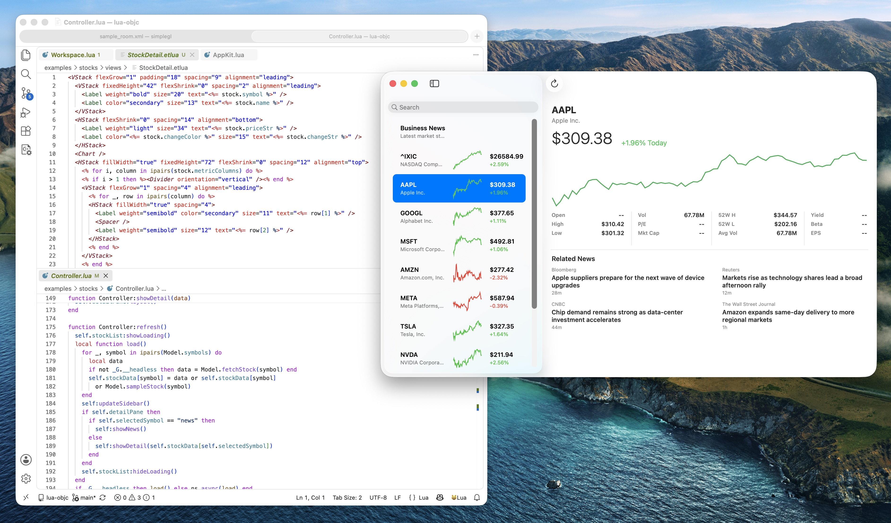
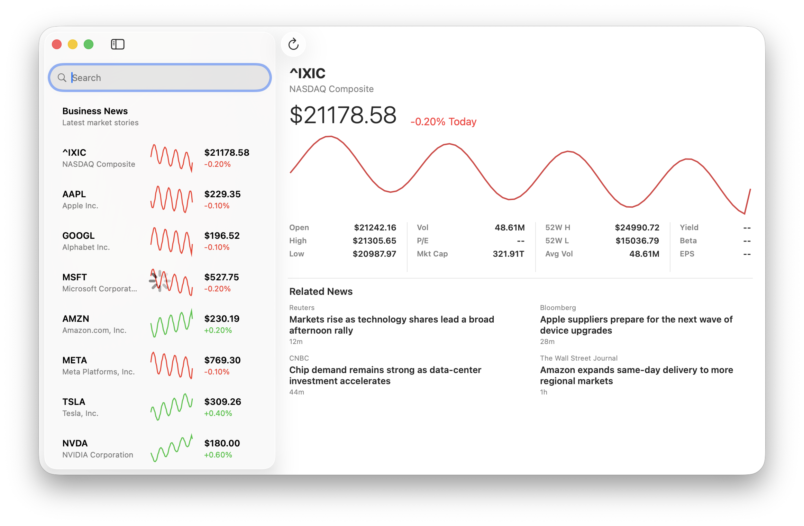

# lua-objc

SwiftUI-style declarative UI written in Lua, rendered by native AppKit or
UIKit controls. Lua apps launch instantly — no Xcode build step, no
compile/run cycle per change.

## Why lua-objc

**SwiftUI is fast for humans but slow for agents.** Every structural change
triggers a full recompilation. A dozen iterations means a dozen Xcode builds.
This is not just theoretical. The tooling pain is widely discussed online:

> "Literally every time I make a change the SwiftUI previews break, requires me
to restart, and give unexpected errors..." — Reddit, r/iOSProgramming
>
> "The preview canvas crashes more than it works." — Reddit, r/SwiftUI
>
> "The Problem: Full app builds take 30+ seconds. That latency kills the
feedback loop." — Reddit, r/SwiftUI
>
> "In reality, the process would take minutes and simulator often stuck in black
screen... I can go on and on about how slow SwiftUI preview is." — Reddit,
r/iOSProgramming

The same theme appears on Stack Overflow and Xcode discussions: builds stall,
previews lag, and simulator startup is flaky enough to break the feedback loop.
lua-objc decouples the app from the toolchain: edit an etlua template or Lua
controller, hit run, and the native window updates instantly. The same code
renders NSTextField on macOS and UILabel on iOS without platform conditionals.

**Agents need testable architecture, not screenshots.** Apps built with
lua-objc follow a strict separation:

```
Model.lua         — pure data, queries, mutations  (headless-testable)
Controller.lua    — wires model → views, owns actions
views/*.etlua     — declarative XML templates
```

Every layer is testable in under a second — no windows, no pauses.
Controllers are instantiated, models are queried, views are rendered and
inspected. The full suite of 14 test files runs faster than one SwiftUI
preview refresh.

**Layout is data, not pixels.** The native layout dump is an XML export of
the entire AppKit/UIKit view hierarchy with computed frames, intrinsic sizes,
text geometry, and explicit `cropped`/`ellipsis`/`outsideParent` flags:



```sh
./lua-objc --dump-layout=/tmp/layout.xml examples/stocks/init.lua
rg -n 'cropped="true"|outsideParent="true"|contentClipped="true"' /tmp/layout.xml
```

An agent reads the XML to verify alignment, truncation, overflow, and column
widths directly — no image recognition or pixel diffing required. The dump
proves that every label fits, every cell isn't cropped, and every divider
aligns before a human ever sees the screen.

## Quick start

Requirements: macOS and Lua 5.4.

```sh
make
make test
make run ARGS="examples/hello"
make run-ide

# Or directly (directory path auto-discovers init.lua):
./lua-objc examples/hello
./lua-objc examples/mail
```

## Stocks app example

This is the current best reference for the product story: a real app built with native AppKit controls, declarative Lua, and cross-platform XML templates — without recompiling the app or touching Xcode.



See [docs/stocks_app_example.md](docs/stocks_app_example.md) for the full walkthrough.

The [weather example](docs/weather_app_example.md) demonstrates asynchronous
HTTP, native loading state, selection-driven detail views, and the current
framework gaps around declarative table row schemas.

Agent-facing documentation is published from [`docs/`](docs/index.md): start
with the [agent quickstart](docs/agents/quickstart.md), then use the
[XML syntax reference](docs/agents/xml-syntax.md) and [Apple UI checklist](docs/agents/apple-ui-checklist.md)
when generating an app.

Render a script without opening a window:

```sh
./lua-objc --preview --width=800 --height=600 \
  --out=/tmp/preview.png examples/layout/init.lua

# Dump AppKit's computed native hierarchy, frames, and table-cell cropping.
./lua-objc --dump-layout=/tmp/layout.xml examples/stocks/init.lua
```

## Where to work

| Task | Start here |
|---|---|
| Maintain native framework `.m` code | `skills/maintain-lua-objc-framework/SKILL.md`, then `src/README.md` |
| Add or compose a Lua widget | `lua/embedded/AppKit.lua` |
| Add a macOS native bridge primitive | `src/README.md`, then the matching `src/appkit/*.m` fragment |
| Change flex layout | `src/appkit/layout.m` |
| Change lists or outlines | `src/appkit/table_data_source.m`, `src/appkit/outline_data_source.m`, `src/appkit/controls.m`, `src/appkit/outline.m`, `docs/tableview_swiftui.md` |
| Change async state ownership, HTTP, timers, or JSON | `src/shared/lua_async.m` |
| Change isolated canvas evaluation | `src/appkit/canvas_eval.m` |
| Change editor highlighting | `src/appkit/syntax_highlight.m` |
| Add an IDE editor surface | `examples/ide/` |
| Write or modify XML view templates | `lua/ui/xml.lua`, `examples/<app>/views/` |
| Use template inheritance or partials | `views/AppWindow.etlua`, `views/partials/` |
| Add a new example app | `examples/<app>/init.lua`, `AGENTS.md` (MVP layout rules) |
| Change app startup or recents | `lua/App.lua`, `examples/ide/` |
| Add UIKit coverage | `src/uikit/`, `src/uikit_module.m`, `lua/embedded/UIKit.lua` |
| Understand runtime ownership | `ARCHITECTURE.md` |
| Look up the Lua API or bridge rationale | `docs/PROJECT_REFERENCE.md` |
| Research Xcode parity | `docs/research/XCODE_UI_ARCHITECTURE.md` |

Search for the symbol you need instead of loading a whole subsystem:

```sh
rg -n 'bridge_tableview|List' src lua tests docs
```

## Architecture

```text
Lua script -> require("AppKit") -> build/AppKit.dylib -> AppKit objects
                                    native bridge +
                                    embedded AppKit.lua
```

`src/host.c` is a small loader. `build/AppKit.dylib` owns the Lua state, AppKit
bridge, layout engine, async services, and embedded declarative layer.
`AppKit.dylib` and `UIKit.dylib` expose the corresponding native modules.

### App structure (MVC)

Every app follows the MVP folder layout:

```
examples/<app>/
  init.lua        — entry point, requires and returns Controller class
  Model.lua       — pure data: queries, formatting, sample data
  Controller.lua  — creates views, wires Model → views, owns actions
  views/          — etlua templates, one per screen/section
```

`init.lua` never self-starts. It returns the class; the framework calls
`class.new():createWindow()`.

## Template system

Templates use etlua (Lua embedded in XML) with cross-platform tags:

```xml
<Window title="My App" width="640" height="420">
    <VStack padding="24" spacing="12">
        <Label text="<%= greeting %>" size="24" weight="bold" />
        <Button title="Click me" />
    </VStack>
</Window>
```

etlua's `<% for %>` loops generate repeated elements before XML parsing,
so templates can iterate data without needing a `ForEach` widget:

```xml
<% for _, article in ipairs(newsColumns) do %>
<VStack fixedHeight="64" fillWidth="true">
    <Label text="<%= article.title %>" size="13" weight="semibold" lines="2" />
    <Label text="<%= article.source %>" size="10" color="secondary" />
</VStack>
<% end %>
```

Key features:

- **Cross-platform**: same template renders on AppKit (macOS) and UIKit (iOS)
- **Window config from XML**: `<Window>` and `<Toolbar>` tags define window properties
- **Template inheritance**: `extends()` / `block()` / `yield()` for layouts
- **Partials**: `partial()` for reusable components

## Testing

All 14 test suites run in under a second — no windows, no pauses:

```sh
make test
```

Tests verify construction, properties, layout contracts, data mutation,
column widths, flex behavior, split proportions, and edge cases (empty,
zero-size, overflow, missing data). Every implementation or bugfix must
include fast headless regression tests.

## Contributing

Contributors are very welcome. Whether you want to improve the native bridge,
add a Lua widget, build an example app, improve UIKit coverage, or strengthen
the tests and documentation, start with the task map above and open an issue or
pull request.

## Repository map

```text
src/                    native runtimes and bridges
  main.m                AppKit translation-unit root and module registration
  appkit/               focused AppKit bridge fragments included by main.m
  uikit/                focused UIKit bridge fragments
  shared/               state ownership, async services, common Lua errors
lua/embedded/           public declarative framework layers
lua/ui/                 cross-platform XML template renderer
lua/vendor/             vendored Lua libraries (etlua submodule)
lua/App.lua             app lifecycle and recent-item persistence
examples/               runnable Lua applications
tests/                  headless Lua integration tests
docs/                   detailed, opt-in reference material
```

## Documentation policy

`AGENTS.md` is deliberately short because it is loaded on every agent task.
Put durable explanations in the focused documents above and link to them from
the task map. Do not copy complete API references or research notes back into
the root instructions.
