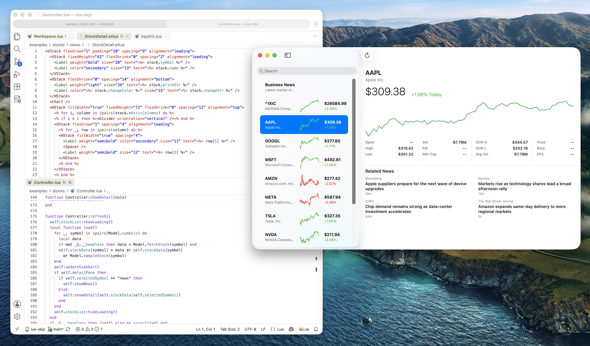
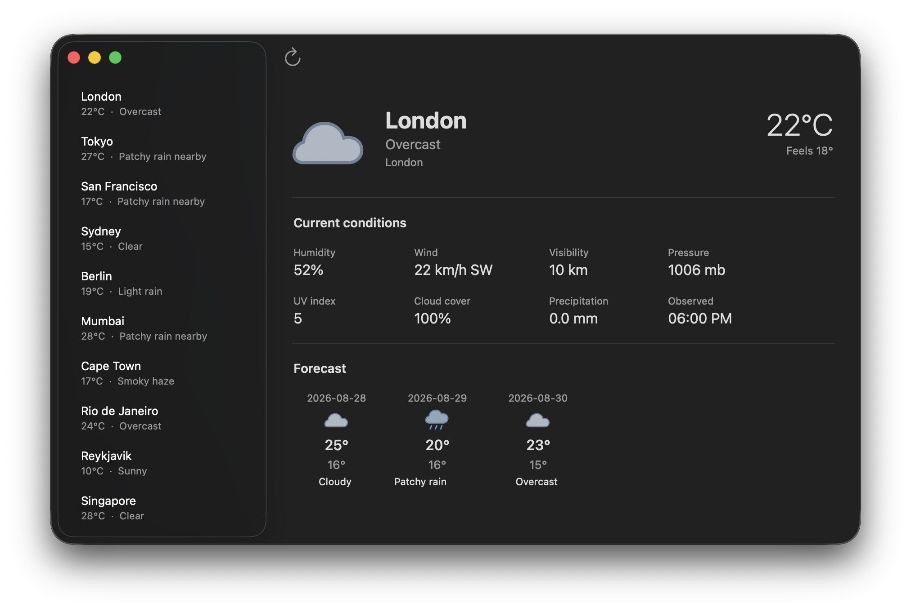

# lua-objc

SwiftUI-style declarative UI written in Lua, rendered by native AppKit or
UIKit controls. Lua apps launch instantly — no Xcode build step, no
compile/run cycle per change.

## Why lua-objc

**SwiftUI is fast for humans but slow for agents.** Every structural change
triggers a full recompilation. A dozen iterations means a dozen Xcode builds.
This is not just theoretical. The tooling pain is widely discussed online:

> "Literally every time I make a change the SwiftUI previews break, requires me
to restart, and give unexpected errors..." — Reddit, r/iOSProgramming
>
> "The preview canvas crashes more than it works." — Reddit, r/SwiftUI
>
> "The Problem: Full app builds take 30+ seconds. That latency kills the
feedback loop." — Reddit, r/SwiftUI
>
> "In reality, the process would take minutes and simulator often stuck in black
screen... I can go on and on about how slow SwiftUI preview is." — Reddit,
r/iOSProgramming

The same theme appears on Stack Overflow and Xcode discussions: builds stall,
previews lag, and simulator startup is flaky enough to break the feedback loop.
lua-objc decouples the app from the toolchain: edit an etlua template or Lua
controller, hit run, and the native window updates instantly. The same code
renders NSTextField on macOS and UILabel on iOS without platform conditionals.

**Agents need testable architecture, not screenshots.** Apps built with
lua-objc follow Laravel's shape: a page is a request. Models query a plain-Lua
store, a route turns them into data, an etlua view draws it, and an action is a
method of the route followed by the same request again:

```
models/*.lua      — Lapis-style models over the store  (headless-testable)
pages/*.lua       — routes: data(state) and one method per action
views/**/*.etlua  — declarative XML templates, sorted like a web frontend
```

See the [application architecture guide](docs/agents/application-architecture.md).

Every layer is testable in under a second — no windows, no pauses.
Controllers are instantiated, models are queried, views are rendered and
inspected. Headless tests provide a fast feedback loop alongside visual QA.

**Layout is data, not pixels.** The native layout dump is an XML export of
the entire AppKit/UIKit view hierarchy with computed frames, intrinsic sizes,
text geometry, and explicit `cropped`/`ellipsis`/`outsideParent` flags:



```sh
./lua-objc --dump-layout=/tmp/layout.xml apps/stocks/init.lua

# Capture only the live AppKit content view from inside the process.
./lua-objc --internal-screenshot=/tmp/content.png apps/stocks/init.lua
rg -n 'cropped="true"|outsideParent="true"|contentClipped="true"' /tmp/layout.xml
```

An agent reads the XML to verify alignment, truncation, overflow, and column
widths directly — no image recognition or pixel diffing required. The dump
proves that every label fits, every cell isn't cropped, and every divider
aligns before a human ever sees the screen.

## Quick start

Requirements: macOS 26 or later, Lua 5.4 and CMake (for the vendored libgit2).
iOS builds also require Xcode with the iPhone Simulator SDK.

```sh
git submodule update --init
make
make test
make run ARGS="demo/hello"
make run-ide

# Or directly (directory path auto-discovers init.lua):
./lua-objc demo/hello
./lua-objc demo/mail
```

iPhone Simulator (host is a runtime; Lua and assets stream from a Mac packager). After the host exists, a save reloads the app **in place** — the process does not quit:

```sh
export DEVELOPER_DIR=/Applications/Xcode.app/Contents/Developer
make ios-run ARGS=demo/hello
# watch Xcode’s Simulator window (not the terminal)
# edit demo/hello/views/Window.etlua, save — UI updates without quitting
```

See [`docs/ios.md`](docs/ios.md) for the host, packager protocol, and coverage contract.

## Weather app example

This is the current best reference for the product story: a real app built with native AppKit controls, declarative Lua, custom SVG artwork, and cross-platform XML templates — without recompiling the app or touching Xcode.



See [docs/weather_app_example.md](docs/weather_app_example.md) for the full walkthrough.

The [weather example](docs/weather_app_example.md) demonstrates asynchronous
HTTP, native loading state, selection-driven detail views, and the current
framework gaps around declarative table row schemas.

Agent-facing documentation is published from [`docs/`](docs/index.md): start
with the [application architecture](docs/agents/application-architecture.md),
then the [agent quickstart](docs/agents/quickstart.md), and use the
[XML syntax reference](docs/agents/xml-syntax.md) and [Apple UI checklist](docs/agents/apple-ui-checklist.md)
when generating an app.

Capture an app's native content and computed layout:

```sh
./lua-objc --internal-screenshot=/tmp/content.png --width=800 --height=600 \
  demo/layout/init.lua

# Dump AppKit's computed native hierarchy, frames, and table-cell cropping.
./lua-objc --dump-layout=/tmp/layout.xml apps/stocks/init.lua
```

`--preview` is a separate synchronous path for scripts returning a native
view; it does not instantiate the Controller class returned by an app entry
point. See [preview behavior](ARCHITECTURE.md#--preview-cli-mode).

## Where to work

| Task | Start here |
|---|---|
| Maintain native framework `.m` code | `skills/maintain-lua-objc-framework/SKILL.md`, then `src/README.md` |
| Add or compose a Lua widget | `lua/embedded/AppKit.lua` |
| Describe an app as data (manifest, Lapis-style models, routes and flows, resources) | `lua/data/`, [`docs/data-driven.md`](docs/data-driven.md), `demo/storage` |
| Add a component (new XML tag, written in etlua) | `lua/components/`, `lua/ui/component.lua`, [`docs/components.md`](docs/components.md) |
| Add a macOS native bridge primitive | `src/README.md`, then the matching `src/appkit/*.m` fragment |
| Change flex layout | `src/appkit/layout.m` |
| Change lists or outlines | `src/appkit/table_data_source.m`, `src/appkit/table_cell_template.m`, `src/appkit/outline_data_source.m`, `src/appkit/controls.m`, `src/appkit/outline.m`, `docs/tableview_swiftui.md` |
| Keep live updates steady, or change static chart geometry | `lua/ui/template.lua`, `lua/ui/xml.lua` (reconcile), `src/shared/arc_path.m`, [`docs/retained-templates.md`](docs/retained-templates.md) |
| Build a 3-D scene or a game | `src/shared/scene_view.m`, `apps/coin-quest/`, [`docs/scenekit.md`](docs/scenekit.md) |
| Change async state ownership, HTTP, timers, or JSON | `src/shared/lua_async.m` |
| Change CLI preview rendering | `src/main.m`, `src/appkit/platform.m` |
| Change editor highlighting | `src/appkit/syntax_highlight.m` |
| Add an IDE editor surface | `demo/ide/` |
| Write or modify XML view templates | `lua/ui/xml.lua`, `apps/<app>/views/` |
| Use template inheritance or partials | `views/AppWindow.etlua`, `views/partials/` |
| Add a new product app | [`docs/agents/application-architecture.md`](docs/agents/application-architecture.md), `apps/diskmap`, `AGENTS.md` |
| Add a framework test app | `test/<app>/init.lua`, `AGENTS.md` (MVC layout rules) |
| Change app startup or recents | `lua/App.lua`, `demo/ide/` |
| Add UIKit coverage | `src/uikit/`, `src/uikit_module.m`, `lua/embedded/UIKit.lua` |
| Run on iPhone Simulator / in-process reload | [`docs/ios.md`](docs/ios.md) |
| Understand runtime ownership | `ARCHITECTURE.md` |
| Look up the Lua API or bridge rationale | `docs/PROJECT_REFERENCE.md` |
| Research Xcode parity | `docs/research/XCODE_UI_ARCHITECTURE.md` |

Search for the symbol you need instead of loading a whole subsystem:

```sh
rg -n 'bridge_tableview|List' src lua tests docs
```

## Architecture

```text
App: Model + Controller + views (etlua templates and partials)
                         |
            Public AppKit.lua / UIKit.lua API
                         |
            Native platform bridge and layout
                         |
                 AppKit / UIKit controls

Shared native services: userdata conversion, Lua state lifetime, async, errors
```

On macOS, `src/host.c` loads `build/AppKit.dylib`; the runtime loads its public
Lua API from `lua/embedded/AppKit.lua`. Diskmap's Xcode project copies that
Lua source tree into the app's Resources. On iOS, `ios/LuaRuntime/` links the
UIKit runtime and streams the public Lua API and app sources from the packager.
`build/UIKit.dylib` is the SDK compile-check, not the Simulator app.

### Who owns an object: Lua or ARC?

**Lua owns the userdata handle; the handle holds a strong native reference.**
`push_objc` stores a `CFBridgingRetain` in `ObjCRef.ptr`. Lua's `__gc` calls
`gc_objc`, which balances it with `CFRelease`. ARC manages native strong
references outside that explicit bridge boundary. See the
[shared implementation](src/shared/lua_bridge_support.m).

| Resource | What keeps it alive? | What releases it? |
|---|---|---|
| Lua model, controller, table, closure | Reachable Lua references, including registry entries | Lua GC after those references disappear |
| Native view or window exposed to Lua | Each userdata handle retains it; native containers and other strong references can also retain it | Userdata finalization releases its retain; native owners release theirs independently |
| Native delegate / data source / layout metadata | A strong property or retained associated object where the bridge installs one | Replacement or destruction of the owning native object |
| Lua callback installed in native code | A Lua registry reference; an integer on the native object identifies it | Explicit `luaL_unref`, or state teardown; cleanup is not yet uniform across controls |
| `lua_State*` | A closing `LuaStateOwner` on macOS; `LRTApplicationController` on iOS | Explicit `lua_close` by the designated owner; ARC cannot free a C pointer itself |

Setting `view = nil` drops a Lua reference. Collection later releases that
handle's native retain; a parent can still keep the view alive. Conversely,
removing a view from a container does not destroy it while Lua still holds a
handle. Two handles may refer to the same native object; Lua table-key identity
must not be used as native object identity.

Callbacks need particular care: a registry-rooted closure can capture a
controller that retains the callback's view. Lua GC and ARC do not jointly
collect that ownership cycle. Dispose registrations explicitly when their
screen or state ends; a native `dealloc` alone cannot break a cycle that keeps
the native object alive. The language rules are described in the
[Lua GC manual](https://www.lua.org/manual/5.4/manual.html#2.5) and
[Clang ARC specification](https://clang.llvm.org/docs/AutomaticReferenceCounting.html).

### Should all `.m` files live in one folder?

**Keep native files in folders by platform and responsibility.** The file
extension does not define an architectural layer:

| Location | Responsibility |
|---|---|
| `src/appkit/` | AppKit controls, navigation, layout, property and method bindings |
| `src/uikit/` | UIKit equivalents and scene integration |
| `src/shared/` | Common bridge conversion, state ownership, async services, errors |
| `ios/LuaRuntime/` | iOS process lifecycle, source loading, reload, capture |
| `src/packager/` | Mac development server for Lua and assets |
| `apps/<app>/` | Product application behavior and composition in Lua |
| `demo/<name>/` | Runnable framework examples and feature demos |
| `test/<name>/` | Runnable apps used specifically as test harnesses |

Nested subsystem folders are fine when they make navigation easier. Use
one shared `.h` per folder that needs cross-file declarations, with the
implementations in separate `.m` files. The iOS host uses `LuaRuntime.h`;
included bridge fragments do not need per-class headers. Preserve
the existing build boundary: `src/main.m` includes AppKit fragments;
`src/uikit_module.m` includes `src/uikit/bridge.m` and its fragments. Included
`.m` files are **not separate compiler inputs**. Add an explicit include when
adding a fragment; Makefile discovery only tracks rebuild dependencies.

One runtime image per platform keeps bridge state and associated-object keys
unique. One image can contain multiple compiled objects; the current included
fragments additionally share translation-unit-local symbols. Moving a file
between folders does not change either boundary. See the
[native source map](src/README.md) for placement and build rules.

### What belongs in Lua, and what belongs in Objective-C?

Keep models and controller actions in Lua. Keep reusable view structure and
template composition in etlua partials under `views/`; controllers render
those templates and wire their refs, but do not construct view trees.
Use Objective-C for native initializers, delegates, platform lifecycle,
rendering, and operations the existing bridge cannot express. Ordinary native
properties use KVC; semantic aliases belong on exported native classes;
non-property operations get explicit bindings. XML is a shared UI vocabulary,
not a second native-property schema.

The current API builds native views eagerly. Lua owns the application state;
native widgets own interaction state, and native containers own their geometry.
The flex engine measures and places framework stacks while respecting those
containers. Mutating a model does not automatically rebuild a view tree.

### What should improve next?

The review identifies these priorities, in dependency order:

1. **Unify callback lifetime.** Done: `LuaReg` + `Scope` replace `gL` and
   bare registry integers. Tests cover invoke, dispose, replacement, interned
   identity, and dead handles.
2. **Make state teardown explicit.** Quiesce native event sources and detach
   callbacks before closing or replacing a state. The async owner already
   provides cancellation; UI callbacks use state-bound `LuaReg` registrations.
3. **Add retained descriptions and keyed reconciliation.** A renderer should
   own mounting, updates, and unmount cleanup while preserving native focus
   and selection. `lua/ui/viewdesc.lua` can describe/diff trees, but its
   `apply` function is currently a no-op; it is not a working renderer.

These are remaining implementation work, not guarantees of the current
runtime. The [architecture guide](ARCHITECTURE.md) records the evidence,
lifetime contracts, and verification requirements.

### App structure

An app is a folder with a one-line `init.lua`, an `app.xml` manifest, a
`Store.lua` seed, and then `models/` (data), `pages/` (routes), `flows/`
(shared action code), `helpers/` (pure computation), `services/` (IO),
`controllers/` (coordination only), `components/` (new XML tags) and `views/`
(etlua only: `layouts/ pages/ sections/ components/ sheets/`):

```
apps/<app>/
  init.lua  app.xml  resources.xml  Store.lua  routes.lua  Controller.lua
  models/ pages/ flows/ helpers/ services/ controllers/ components/ views/
```

A small app is just `init.lua`, `Model.lua`, `Controller.lua` and `views/`.
`init.lua` never self-starts; the framework calls `class.new():createWindow()`.
The [application architecture guide](docs/agents/application-architecture.md)
says exactly what goes where, with examples for each piece, and describes the
two shapes (sidebar apps like Diskmap, tab-bar apps like Adventure Arena).

### A PHP reference point: Laravel with Blade

Think of lua-objc as **Laravel-style application structure and templates,
rendering real AppKit/UIKit controls, with a persistent native application
lifecycle**. The PHP analogy fits the authoring workflow: application code
prepares data, passes it to a template, and the runtime turns it into an
interface.

| Laravel concept | lua-objc equivalent |
|---|---|
| Route and controller action | `pages/*.lua`: `data(state)` and a method per action |
| Eloquent models | `models/*.lua`, Lapis-style tables over the store |
| Service classes | `services/`, injected |
| Blade templates | `views/*.etlua` |
| Includes, layouts, and sections | `partial()`, `extends()`, `block()`, `yield()` |
| Reusable view components | etlua partials emitting native view trees |
| Routes dispatch actions | Native callbacks invoke controller methods |

The [hello controller](demo/hello/Controller.lua) shows the basic flow:
take model data, render a template, and create a window. The
[mail controller](demo/mail/Controller.lua) adds interaction: selecting
a message marks it read and updates the detail pane in the existing window.

**The key difference is lifetime.** Laravel's web flow handles a request and
returns a response. A lua-objc controller and its native widgets stay alive
across selection, typing, asynchronous results, and navigation. The controller
coordinates persistent views while models own domain state and etlua templates
own presentation. Nothing observes a model: a page is asked for its data again
after an action, and the retained template reconciles only what changed.

Use Laravel's [views](https://laravel.com/docs/12.x/views) and
[Blade](https://laravel.com/docs/12.x/blade) as guides for application
organization and template composition, with its
[request lifecycle](https://laravel.com/docs/12.x/lifecycle) marking the
boundary of the analogy. This is an architectural comparison, not feature
parity: `Model.lua` is ordinary Lua domain code, not an Eloquent-style ORM.

The practical guide for apps is:

- Routes supply each page's data and own its actions; controllers only coordinate (sheets, navigation, commands).
- Models own queries, fetching, validation, and mutations.
- Views own presentation through etlua templates and reusable partials.
- The framework owns shared rendering, action binding, and lifecycle
  machinery. Retained descriptions and reconciliation remain framework work.

## Template system

Templates use etlua (Lua embedded in XML) with cross-platform tags:

```xml
<Window title="My App" width="640" height="420">
    <VStack padding="24" spacing="12">
        <Label text="<%= greeting %>" size="24" weight="bold" />
        <Button title="Click me" />
    </VStack>
</Window>
```

etlua's `<% for %>` loops generate repeated elements before XML parsing,
so templates can iterate data without needing a `ForEach` widget:

```xml
<% for _, article in ipairs(newsColumns) do %>
<VStack height="64" maxWidth="infinity">
    <Label text="<%= article.title %>" size="13" weight="semibold" lines="2" />
    <Label text="<%= article.source %>" size="10" color="secondary" />
</VStack>
<% end %>
```

Key features:

- **Cross-platform**: same template renders on AppKit (macOS) and UIKit (iOS)
- **Window config from XML**: `<Window>` and `<Toolbar>` tags define window properties
- **Template inheritance**: `extends()` / `block()` / `yield()` for layouts
- **Partials**: `partial()` for reusable components

## Large collections

Use native `List` for table-style collections. Use `<LazyVStack>` or
`<LazyVGrid>` when rows need arbitrary etlua views; their native collection
hosts create item views only as they become visible. Eager `<VStack>` and
`<Grid>` construct every child. The [reorder examples](demo/lazy-reorder/README.md)
show the lazy containers and difference callbacks.
`benchmarks/run_list.sh` compares equal simple text rows in lua-objc and the
[`SwiftUI source`](benchmarks/swiftui_list.swift). One macOS 27.0 / Apple M1
run at an 800 × 600 initial layout (2026-09-23) reported:

| Rows | Implementation | Initial construction + layout | Peak process RSS |
|---:|---|---:|---:|
| 1,000 | lua-objc eager VStack | 0.229 s | 79.8 MB |
| 1,000 | lua-objc native List | 0.027 s | 46.1 MB |
| 1,000 | SwiftUI eager VStack | 0.238 s | 66.1 MB |
| 1,000 | SwiftUI LazyVStack | 0.029 s | 41.9 MB |
| 1,000 | SwiftUI List | 0.046 s | 41.4 MB |
| 5,000 | lua-objc eager VStack | 1.082 s | 207.6 MB |
| 5,000 | lua-objc native List | 0.014 s | 47.2 MB |
| 5,000 | SwiftUI eager VStack | 0.736 s | 179.5 MB |
| 5,000 | SwiftUI LazyVStack | 0.022 s | 42.0 MB |
| 5,000 | SwiftUI List | 0.023 s | 41.9 MB |

These samples predate the lazy collection API. Each ran in a fresh process,
with startup included in RSS. They do not
measure first presentation or scrolling. The native List uses much less time
and memory than either eager stack in this simple-row test, while SwiftUI's
lazy containers use slightly less memory. See
[`benchmarks/README.md`](benchmarks/README.md) for device measurements and
the exact method.

On an iPhone 14 Pro Max at 120 Hz, the 5,000-row native List recorded 119.6
display-link callbacks per second and a 32.1 MiB peak footprint while
scrolling. The matching SwiftUI List recorded 119.7 callbacks per second and
16.9 MiB; SwiftUI `LazyVStack` recorded 120.1 callbacks per second and 15.5
MiB. These are one-run pacing samples, not presented-frame FPS.
An Instruments Animation Hitches trace of the foreground lua-objc List showed
119 display surface swaps per second on average during seven steady seconds
and two potential 8.34 ms hitches early in the capture. See the benchmark
notes for the trace method and scope of that device-wide counter.

## Private API research

Navigation palettes have an experimental
`enablePrivateNavigationPalettes="true"` opt-in on iOS 26.5. The flag defaults
to false; public `titleView` and `UIToolbar` host the same views otherwise.
Private APIs can trigger App Review rejection and break without notice, so
do not use the opt-in in a production app. `LazyLayout` remains research only;
see [`docs/PRIVATE_API_RESEARCH.md`](docs/PRIVATE_API_RESEARCH.md).

## Testing

Run the headless regression suites:

```sh
make test
```

Tests verify construction, properties, layout contracts, data mutation,
column widths, flex behavior, split proportions, and edge cases (empty,
zero-size, overflow, missing data). Every implementation or bugfix must
include fast headless regression tests.

## Contributing

Contributors are very welcome. Whether you want to improve the native bridge,
add a Lua widget, build an example app, improve UIKit coverage, or strengthen
the tests and documentation, start with the task map above and open an issue or
pull request.

## Repository map

```text
src/                    native runtimes and bridges
  main.m                AppKit translation-unit root and module registration
  appkit/               focused AppKit bridge fragments included by main.m
  uikit/                focused UIKit bridge fragments
  shared/               state ownership, async services, common Lua errors
lua/embedded/           public declarative framework layers
lua/ui/                 cross-platform XML template renderer
lua/vendor/             vendored Lua libraries (etlua submodule)
vendor/                 Lua 5.4 source for iOS; libgit2 submodule for the Git module
lua/App.lua             app lifecycle and recent-item persistence
apps/               product applications
demo/               runnable framework examples and feature demos
test/               runnable test harness apps
modules/reel/           Reel: offline motion pieces from etlua (not part of the runtime)
reels/              motion pieces rendered with modules/reel
tests/                  headless Lua integration tests
docs/                   detailed, opt-in reference material
```

## Documentation policy

`AGENTS.md` is deliberately short because it is loaded on every agent task.
Put durable explanations in the focused documents above and link to them from
the task map. Do not copy complete API references or research notes back into
the root instructions.

### Develop apps from an iPad

`make ipad-deploy` builds **Lua Studio**, automatically finds one available physical iPad,
signs with a matching installed development profile, and installs/launches it.
Use `make ipad-run` for the simulator. The app includes an interactive phone-sized
UIKit preview, an OpenRouter coding agent, system keyboard dictation, source
editing, and undo. Projects run and save locally without the Mac packager.
See [Lua Studio](apps/studio/README.md) for setup and current boundaries.

Deploy an app from `apps/<name>/` to an iPhone with
`make iphone-deploy APP=adventure-arena`. It uses the same build, signing, and
install flow and automatically selects the only available physical iPhone.

### Releases: GitHub and App Store Connect

[Release apps](.github/workflows/release.yml) builds a tag `v1.2.3` with
Makefiles and the Apple command-line toolchain. It does not invoke
`xcodebuild`, read `.xcodeproj` files, or depend on Xcode Cloud.
The existing Xcode projects are optional development tools. Their Cloud
workflows can be disabled in App Store Connect after the first successful
Actions upload; this repository change does not disable those remote workflows.

Each project declares its platform and channels in
[`scripts/release/apps.json`](scripts/release/apps.json):

| App | Platform | GitHub release | App Store Connect |
|---|---|---|---|
| Diskmap | macOS, arm64 | Notarized DMG and Store PKG | Signed PKG |
| Drum & Bass | macOS, arm64 | Notarized DMG | Not configured |
| Adventure Arena | iPhone and iPad, arm64 | Signed IPA | Same IPA |

An `ios` entry builds one universal app with `UIDeviceFamily=[1,2]`.
An `iphone` entry sets `[1]`; an `ipad` entry sets `[2]`.
These never build a macOS app. macOS entries never build the UIKit host.
Add another app by adding a manifest record with its product, platform
(`macos`, `ios`, `iphone`, or `ipad`), channels and signing/resource settings.
A Store app also needs an existing App Store Connect record, an explicit
App Store distribution profile and an exportable distribution private key.
Drum & Bass can add the `appStore` channel when its Store record, icon,
sandbox entitlements and profile are ready.

The runner selects a stable Xcode 26.5+ installation for `clang`, SDKs,
`actool`, `codesign`, `productbuild`, `notarytool` and `altool`.
macOS releases embed vendored Lua in AppKit.dylib, with no Homebrew runtime
dependency. Both delivery channels use copies of the same compiled app:
Developer ID signing and notarization for a DMG; distribution signing with
an embedded provisioning profile for Store PKG/IPA. Development, ad hoc,
enterprise, expired and mismatched Store profiles are rejected.
The generated bundle gets version `1.2.3` and build number
`<Actions run number>.<attempt>`; source plists stay unchanged.
Debug symbols are retained as Actions artifacts.

Configure repository **Actions secrets** (binary files are base64 encoded):

| Secret | Purpose |
|---|---|
| `MACOS_CERTIFICATE_P12` | Developer ID Application certificate **and private key**, `.p12`, for DMGs |
| `MACOS_CERTIFICATE_PASSWORD` | Its export password (omit for an empty password) |
| `NOTARY_KEY_P8` | App Store Connect team API key `.p8`, for notarization |
| `NOTARY_KEY_ID`, `NOTARY_ISSUER_ID` | That key's ID and issuer UUID |
| `APPSTORE_CERTIFICATE_P12` | Apple Distribution certificate(s) and private key(s), `.p12`, matching both Store profiles |
| `APPSTORE_CERTIFICATE_PASSWORD` | Its export password (omit for an empty password) |
| `APPSTORE_INSTALLER_P12` | 3rd Party Mac Developer Installer certificate and private key, `.p12`, for Store PKGs |
| `APPSTORE_INSTALLER_PASSWORD` | Its export password (omit for an empty password) |
| `APPSTORE_KEY_P8` | App Store Connect team API key `.p8`, authorized to upload builds |
| `APPSTORE_KEY_ID`, `APPSTORE_ISSUER_ID` | That key's ID and issuer UUID |
| `DISKMAP_APPSTORE_PROFILE` | Diskmap macOS App Store provisioning profile |
| `ADVENTURE_ARENA_APPSTORE_PROFILE` | Adventure Arena iOS App Store provisioning profile |

The notary and upload key may be the same team API key with suitable access;
set both secret groups explicitly. A Developer ID certificate cannot sign
an App Store app. GitHub secret values cannot be read back; only their names
can be inspected. No `.p12`, `.p8` or private key goes into a release artifact.

Configure **Actions variables**, containing each app's numeric Apple ID
from App Store Connect → App Information:
`DISKMAP_APPSTORE_ID` and `ADVENTURE_ARENA_APPSTORE_ID`.
The manifest's `appStoreIdVariable` selects the appropriate variable.

Push a `v1.2.3` tag after committing the release sources and submodule
revisions. Actions builds each declared platform, attaches signed packages
to the GitHub release and validates/uploads the Store packages. Missing
credentials fail with their names; a release never silently omits a Store
upload. For a credential-free check, dispatch **Release apps** with an
existing tag and `buildOnly=true`; it retains builds only in Actions.

Local commands use the same pipeline:

```sh
make release-build APP=adventure-arena VERSION=1.2.3 BUILD_NUMBER=123.1
make release APP=diskmap VERSION=1.2.3 BUILD_NUMBER=123.1 UNSIGNED=1
# Installed Developer ID identity and NOTARY_KEY/NOTARY_KEY_ID/NOTARY_ISSUER_ID:
make release APP=diskmap VERSION=1.2.3 BUILD_NUMBER=123.1
# Also installed Apple Distribution and Mac Installer identities:
make release APP=diskmap VERSION=1.2.3 BUILD_NUMBER=123.1 STORE=1 PROFILE=/path/to/diskmap.provisionprofile
make release APP=adventure-arena VERSION=1.2.3 BUILD_NUMBER=123.1 STORE=1 PROFILE=/path/to/arena.mobileprovision
# APPSTORE_KEY is a .p8 path; APPSTORE_KEY_ID, APPSTORE_ISSUER_ID and APPSTORE_APP_ID are required:
make appstore-upload APP=adventure-arena VERSION=1.2.3
make publish VERSION=1.2.3
```

Upload acceptance is followed by Apple's processing. Uploading does not
submit an App Review request or enroll external testers automatically.
Adventure Arena's Store record is **Elsewhere: Text Adventures**; its
**Public Beta** invitation remains https://testflight.apple.com/join/dvkhrmXh.
External testing still requires the applicable Beta App Review.

Apple documents [command-line build uploads](https://developer.apple.com/help/app-store-connect/manage-builds/upload-builds/)
and [Mac Store package signing](https://developer.apple.com/documentation/xcode/packaging-mac-software-for-distribution).

### Adventure Arena tour screenshots

The first-launch guide uses real iPhone reader captures in light and dark.
To refresh its eight bundled images after changing the reader:

```sh
make adventure-arena-tour-captures
```

This uses the iPhone 17 Pro simulator and an in-memory library, preserving
saved stories and restoring the simulator's appearance afterward. The plan
is `apps/adventure-arena/tour/capture.lua`; its crop box matches the onboarding
template. Settings → How to Play reopens the four guide pages without setup.
