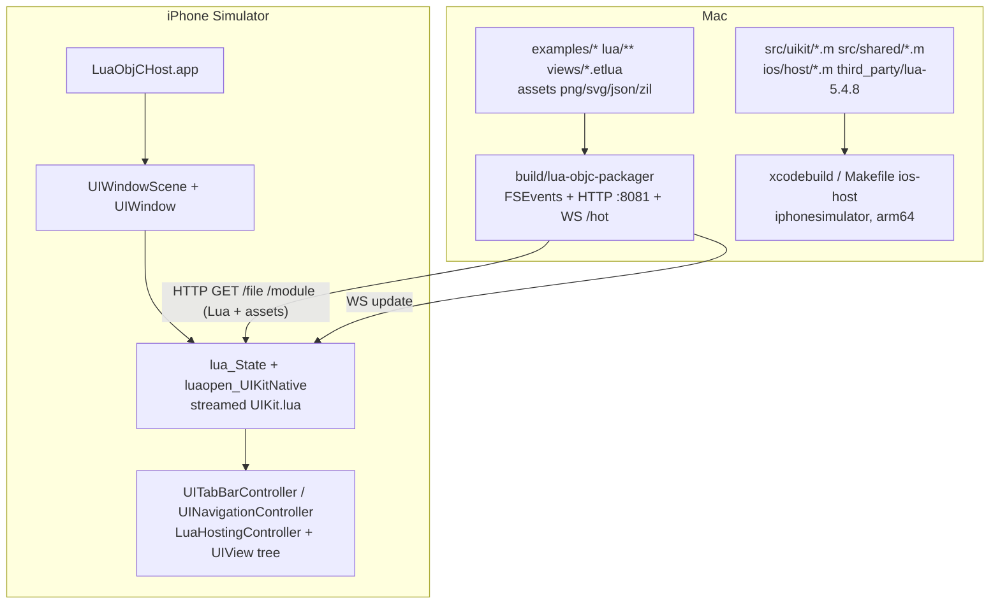
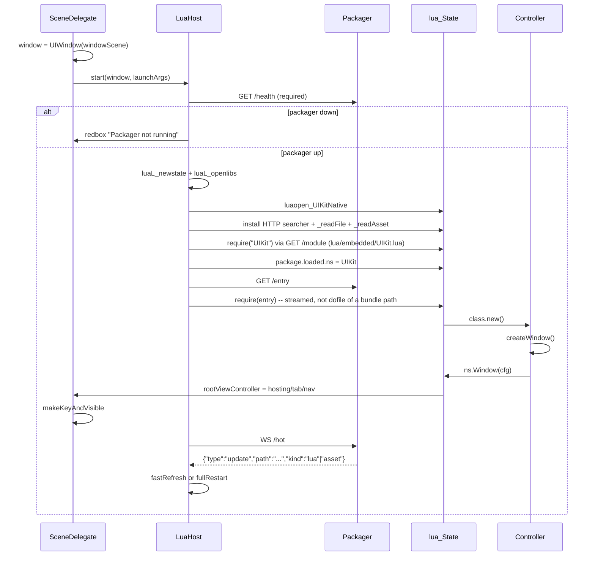

# iOS Support, iPhone Simulator Host, and React Native-style Hot Reload

| Field | Value |
|---|---|
| Author | TBD |
| Date | 2026-09-04 |
| Status | Draft |
| Repo | `lua-objc` |
| Intended path | [`docs/ios.md`](ios.md) |

This document is both an implementation spec and an operator how-to. An engineer should be able to land PR1 without inventing host boot, Lua loading, or the `ns.Window` mapping.

---

## Overview

lua-objc already has a complete AppKit product and a UIKit *stub*: `make` builds `build/UIKit.dylib` with the iPhone Simulator SDK when Xcode is present, but there is no iOS host, no scene, no packager, and `lua/embedded/UIKit.lua` is a thin copy of a few AppKit constructors. `src/uikit/views.m` `bridge_window` requires an attached `UIWindowScene`, so the macOS loader `src/host.c` cannot run UIKit.

This work adds a real iPhone Simulator host that statically compiles Lua 5.4.8 plus the UIKit translation unit (`src/uikit_module.m` includes `src/uikit/*.m` and `src/shared/*.m` — those fragments are **not** extra Compile Sources). The `.app` is a **runtime**, not an app bundle: it contains no Lua, templates, or images. A Mac packager streams every `.lua` / `.etlua` file and every asset (`png`, `svg`, `json`, game data, …) over HTTP, and pushes change events over WebSocket. The operator loop never rebuilds or reinstalls.

**The host process does not quit on reload.** A save does not `simctl launch`, does not terminate `LuaObjCHost`, and does not tear down the `UIWindowScene`. The packager sends `update` over WebSocket; the running host replaces `rootViewController` (or, for `Model.lua` / `init.lua`, recycles the in-process `lua_State`) and keeps the Simulator on screen. A Lua error is a redbox overlay, not a crash. This is the React Native Fast Refresh analogue: native runtime stays up, app Lua and assets stream in.

Success is **coverage**, not a port: AdventureArena’s SwiftUI screens at `/Users/igor/Developer/adventure-arena` define the primitive set that must exist in Lua + XML + real UIKit. AdventureArena itself is not ported in this workstream.

---

## Background & Motivation

### Current lua-objc state

AppKit is the product. `lua/embedded/AppKit.lua` exposes Window, Panel, stacks, splits, ScrollView, List, OutlineView, ToolbarItem, Button, Toggle, Slider, Stepper, Picker, Text/TextField/SearchField/TextEditor, SystemImage, ForEach, Group, async/fetch/json. `src/host.c` `dlopen`s `build/AppKit.dylib` and calls `lua_objc_main` in `src/main.m`. Apps live in `examples/<app>/` and follow the MVP layout (`init.lua`, `Model.lua`, `Controller.lua`, `views/*.etlua`). XML in `lua/ui/xml.lua` is already documented as cross-platform: the same `<Label>` is `ns.Text` → `NSTextField` on AppKit and `ns.Label`/`ns.Text` → `UILabel` on UIKit.

UIKit is a compile-check, not a runtime:

| Piece | Reality |
|---|---|
| `Makefile` `build/UIKit.dylib` | `xcrun --sdk iphonesimulator` + `-undefined dynamic_lookup` + Homebrew Lua *headers*. Not a loadable iOS image. |
| `src/uikit_module.m` | Embeds `lua/embedded/UIKit.lua`, includes `src/uikit/bridge.m`. Correct module shape. |
| `src/uikit/bridge.m` `bridge_lib` | `_vstack`, `_hstack`, `_hsplit`, `_spacer`, `_textField`, `_label`, `_separator`, `_progressIndicator`, `_button`, `_toggle`, `_window`, `_image`, `_add`, `_layout`, `_setContentSize`, `_tableview`, `_show`, `_font`, `_timerAfter`, `_httpGet`, `_jsonParse`. |
| `src/uikit/views.m` `bridge_window` | Iterates `UIApplication.sharedApplication.connectedScenes` and errors with `"UIKit.Window requires an attached UIWindowScene"`. |
| `src/uikit/constructors.m` | `UIView` stacks, `UITextField`, `UILabel`, 1pt separator, `UIActivityIndicatorView`, `UIButtonTypeSystem`, `UISwitch`. |
| `src/uikit/tables.m` | `UITableViewStylePlain` only; `LuaTableViewSource` joins column values into `cell.textLabel`. No sections, swipe, refresh, `replaceRows`. |
| `lua/embedded/UIKit.lua` | Window clones AppKit’s 480×360 constructor; `Switch` instead of `Toggle`; no ScrollView, SystemImage, TabView, NavigationStack, Picker, Slider, TextEditor, sheets. |
| File watch | `bridge_watch_file` in `src/appkit/platform.m` is FSEvents. Unavailable in the simulator for a Mac source tree. |
| Preview | `src/appkit/canvas_eval.m` is an isolated AppKit canvas `lua_State` that monkey-patches `ns.Window`. Not an iOS path. |
| Layout dump / screenshot | `--dump-layout` / `--screenshot` live in `lua_objc_main` (`src/main.m`). iOS has no equivalent. |

`ARCHITECTURE.md` already states the intended load:

```lua
require("UIKit")   -- luaopen_UIKit in UIKit.dylib, inside an iOS host
```

The host is the missing piece. UIKit also uses `LUA_OBJC_EXTERNAL_STATE_OWNER`: `install_external_lua_state_owner` in `src/shared/lua_async.m` installs a **non-closing** `LuaStateOwner`. That is correct for an iOS host that owns `lua_close`.

### Why AdventureArena is the coverage target

AdventureArena is a shipping SwiftUI iPhone app (deployment target **iOS 26.5**, same generation as lua-objc’s macOS 26 rule) with the chrome an iOS lua-objc app actually needs: `TabView`, `NavigationStack`, paging carousel, `List` + swipe-to-delete, `ScrollView`, composer + keyboard, sheets, menus, SF Symbols, `@AppStorage`, pull-to-refresh, empty states. Mapping those primitives is the contract. CloudKit, Translation.framework, and the in-app LLM are **not**.

### Pain points this removes

1. There is no way to run `examples/hello` on a phone.
2. UIKit.lua’s `Window(title, width, height)` is a macOS window pretending to be iOS.
3. XML already claims Slider/Stepper/Picker are AppKit-only (`docs/agents/xml-syntax.md`); iOS apps cannot share those templates.
4. Reloading Lua on iOS cannot use FSEvents inside the simulator.
5. Agents iterating SwiftUI pay an Xcode compile per change; lua-objc’s pitch is “edit Lua, native UI updates.” That pitch is currently macOS-only.

---

## Goals & Non-Goals

### Goals

- Launch Lua apps on the **iPhone Simulator** (iOS 26.5 SDK, Xcode 26) with real UIKit controls.
- The host is compiled **once**. After that, the only data path is the packager: Lua, etlua, and assets stream over HTTP; saves hot-reload over WebSocket. No rsync into the `.app`, no `make ios-host` in the daily loop.
- Cross-platform XML: the same `views/*.etlua` compiles through `lua/ui/xml.lua` with `ns` injected. New tags (`TabView`, `NavigationStack`, `ZStack`, `Section`, `Sheet` presentation is controller-side) land in `TAG_SCHEMA`.
- Coverage of the AdventureArena primitive set (table below). App-level widgets (message bubbles, compass, star rating, cover image) are **composed in Lua**, not new native classes.
- Headless tests for XML/API/packager on macOS; simulator tests for native construction, layout dump, and screenshots.
- Operator workflow: `make ios-run ARGS=examples/hello`. That starts the packager, boots the already-built host if needed, and streams the app.

### Non-Goals

- **Porting AdventureArena** into `examples/adventure`. Optional later example; not this workstream.
- CloudKit, Translation.framework, on-device LLM, Game Center, App Intents, widgets, live activities.
- Shipping to a physical device or App Store in v1 (design the host so a later device PR is codesign + SDK switch, not an architecture change).
- Running `UIKit.dylib` inside `src/host.c` on macOS.
- Mac Catalyst.
- Wrapping UIKit in SwiftUI / `UIViewRepresentable`.
- Using React Native, Expo, or Yoga as the iOS layer.
- True view-tree reconciliation in v1 hot reload (`lua/ui/viewdesc.lua` exists for a later PR).
- Bundling `lua/`, `examples/`, `views/`, or assets into `LuaObjCHost.app` as a development path. The host has no app payload. Packager-down is a redbox, not a fallback copy.
- Rebuilding or reinstalling the host because a Lua file, template, or asset changed.
- FSEvents (or `bridge_watch_file`) inside the simulator pointed at the Mac repo.
- Routing iOS previews through `src/appkit/canvas_eval.m`.
- Custom-drawn iMessage chrome, fake tab bars (`UISegmentedControl` as a tab bar), fake navigation bars, or private `NSTabBar` equivalents.
- Per-panel `cornerRadius` / shadow APIs (project rule). Image clipping may use `UIView.layer` via a view accessor if a later PR needs it; not a panel chrome API.
- Changing AppKit window tabbing or replacing `NSToolbar` on macOS.
- Bumping Lua to 5.5 (LuaKit’s vendored version). lua-objc stays on **Lua 5.4.8**.

---

## Key Decisions

1. **The product on iOS is a Simulator host app, not `UIKit.dylib`.** `build/UIKit.dylib` stays as an optional compile-check (`make uikit`) until the host exists; the host statically includes the same translation unit. iOS apps cannot `dlopen` a `-undefined dynamic_lookup` dylib as the runtime, and App Store rules make a static host the React Native analogue.

2. **Vendor and compile Lua 5.4.8 for `iphonesimulator`.** Homebrew Lua is a macOS dylib. AdventureArena’s LuaKit vendors **Lua 5.5** (`External/LuaKit/Sources/Lua/include/lua.h`). lua-objc’s macOS toolchain is Lua 5.4.8. The host compiles `third_party/lua-5.4.8/` with `-DLUA_USE_IOS`. Do not link LuaKit.

3. **`ns.Window` on iOS is SwiftUI `WindowGroup`, not a sized `UIWindow`.** The current UIKit constructor (`title`, `width=480`, `height=360`, `win:add(vstack)`, `win:show()`) is deleted, not aliased. XML `<Window>` is already a **config record** (`kind = "record"`, `__isWindowConfig`) and never calls `ns.Window`. The controller still does `return ns.Window(cfg)`. On iOS that installs `cfg.content` as `UIWindow.rootViewController` and fills the `UIWindowScene`. Width/height are ignored.

4. **iOS navigation is `UIViewController`-based.** `UITabBarController` and `UINavigationController` are first-class. Stacks, labels, and buttons remain `UIView`. A `LuaHostingController` wraps a Lua-laid-out `UIView` when a controller child is a view. Do not fake a tab bar or nav bar with segments or custom drawing.

5. **The host injects the platform module as `require("ns")`.** macOS `lua_objc_main` also registers AppKit as `ns` (the **same table**, not a forwarding stub). `xml.render` defaults to `require("ns")`. Existing `require("AppKit")` / `require("UIKit")` keep working because those names stay in `package.loaded` pointing at the same table. Call-site migration to `require("ns")` is a follow-up, not a host-boot blocker. No `or require("AppKit")` fallback shim.

6. **Hot reload v1 rebuilds the root view controller and preserves `Model`.** Not a virtual-DOM diff. `lua/ui/viewdesc.lua` remains the later reconciliation path (ARCHITECTURE.md already marks it “for future diffing”). Fast refresh **must not** call `LuaStateOwner -cancel` on the live owner: `-cancel` sets `_cancelled = YES` for the life of the owner, so `_httpGet` / `_timerAfter` / `ns.sleep` would never run again. Cancel the current `NSURLSession`/`NSTimer` set (or swap extraspace to a fresh non-closing owner) and bump a `refreshGeneration` integer. Controller/XML changes rebuild chrome; Model is the preserved state.

7. **The Mac packager is the only source of Lua and assets.** The host is a native VM + UIKit bridge. It does not copy the repo into the `.app`. HTTP serves modules, templates, and binary assets; WebSocket pushes `update` events; the Simulator is a client. No FSEvents inside the sim for `~/Developer/lua-objc`. Changing `.lua`, `.etlua`, images, or game data **never** rebuilds the host. Native `.m` changes are a framework-engineer event outside this loop and are not watched.

8. **Do not reuse `canvas_eval.m`.** That path creates a throwaway AppKit `lua_State` and monkey-patches `ns.Window` → `ns.VStack` for Xcode-like macOS previews. iOS previews are a real SimulatorKit device. Hot reload keeps one host-owned `lua_State`.

9. **Deployment target is iOS 26.5.** Match AdventureArena (`IPHONEOS_DEPLOYMENT_TARGET = 26.5`) and lua-objc’s macOS 26 rule. Makefile `IOS_MIN` / Info.plist `MinimumOSVersion` are **26.5**, not 26.0. Use current UIKit (`UIView.keyboardLayoutGuide`, `UISheetPresentationController` detents, `UIButton.Configuration`). Map `style="borderedProminent"` to `+[UIButtonConfiguration borderedProminentButtonConfiguration]` (public since iOS 15). Do not invent `prominentFilledButtonConfiguration`. No appearance shims, no old-material fallbacks.

10. **Default simulator device is `iPhone 17`.** Current Xcode 26.6 / iOS 26.5 runtimes on this machine: iPhone 17, 17 Pro, 17 Pro Max, 17e, iPhone Air. Override with `DEVICE`. Detect via `xcrun simctl list devices available`.

11. **AdventureArena widgets that are not system controls are Lua compositions.** Compass = buttons + `SystemImage`; stars = five SF Symbols; message bubbles = `Label` + semantic colors + layout; cover image = `Image` from file. No `CGPath` fake chrome.

12. **`ContentUnavailableView` is not a UIView.** There is no public UIKit class. `ns.ContentUnavailable` is a Lua function that composes `SystemImage` + `Title` + `Label` with system fonts and semantic colors.

---

## Proposed Design

### Architecture



Native UIKit is compiled into the host once. App Lua is either:

- **Dev:** fetched from the packager (`LUA_OBJC_PACKAGER=http://127.0.0.1:8081`).
- **Bundled:** copied into `LuaObjCHost.app/lua` and `LuaObjCHost.app/examples` for packager-less simulator runs.

### Directory layout

```text
ios/
  LuaObjCHost.xcodeproj          ← scheme LuaObjCHost, iphonesimulator
  LuaObjCHost/
    Info.plist
    main.m                       ← UIApplicationMain
    AppDelegate.m                ← UIApplicationDelegate
    SceneDelegate.m              ← creates UIWindow, starts LuaHost
    LuaHost.m                    ← lua_State, searcher, createWindow, hot reload
    LuaSourceLoader.m            ← packager HTTP only (Lua + assets)
    LuaHotClient.m               ← WebSocket client
    LuaErrorOverlay.m            ← redbox
    LuaHostingController.m       ← UIViewController hosting a Lua UIView
    LuaLayoutDump.m              ← UIKit hierarchy XML
    Assets.xcassets / AppIcon
third_party/
  lua-5.4.8/                     ← official Lua 5.4.8 sources (no lua.c/luac.c in lib)
src/packager/
  packager.m                     ← Mac FSEvents + HTTP + WS → build/lua-objc-packager
src/uikit/                       ← existing fragments, extended in later PRs
  navigation.m                   ← NEW: TabView, NavigationStack, sheets, bar items
  scroll.m                       ← NEW: UIScrollView
  overlay.m                      ← NEW: ZStack
  defaults.m                     ← NEW: NSUserDefaults
  layout_debug.m                 ← NEW: dump analogue of src/appkit/layout_debug.m
```

Fragments remain `#include`d by `src/uikit/bridge.m`. They are not separate linker inputs. `src/README.md` is updated when a fragment is added.

Xcode **Compile Sources** (do not glob `src/uikit/*.m` or `src/shared/*.m` — `bridge.m` already `#include`s them, and compiling both double-defines every static):

- `ios/LuaObjCHost/*.m` (host only: scene, loader, overlay, dump)
- `src/uikit_module.m` (provides `luaopen_UIKit` / `luaopen_UIKitNative`; `#include`s `src/uikit/bridge.m`)
- `liblua.a` from `third_party/lua-5.4.8/*.c` (no ARC, exclude `lua.c`/`luac.c`, `-DLUA_USE_IOS`, `ARCHS=arm64`)

`LUA_OBJC_EXTERNAL_STATE_OWNER` stays defined in `src/uikit/bridge.m`. The host creates the `lua_State`, calls `luaopen_UIKit`, and is responsible for `lua_close` on teardown / full restart.

`LuaHostingController` is compiled as part of `ios/LuaObjCHost/*.m`. After `luaopen_UIKitNative` and streamed `require("UIKit")`, `LuaHost` pushes `_hostingController` / `_installScene` into `package.loaded.UIKitNative` (or `LuaHostingController.m` is `#include`d from `bridge.m` — pick **one**; default: host injects the two C functions so the dylib compile-check does not need the host symbols). `extern UIWindow *lua_objc_host_window(void);` is defined in `LuaHost.m`. The `make uikit` dylib does not call it.

The `.app` contains **no** `lua/`, `examples/`, `views/`, or asset trees. `LuaSourceLoader` talks only to the packager (`GET /module`, `GET /file`). `package.path` is unused for app code; a packager searcher is installed first and is the only searcher that can load `examples.*`, `ui.*`, `etlua`, `App`, and `lua/embedded/UIKit.lua`. `io.open` of a process-relative path will miss (Simulator cwd is not the git root) and is not a fallback.

If the packager is unreachable at boot, show the redbox: “Packager not running. `make ios-run ARGS=…`”. Do not ship a bundled copy of hello “just in case.”

### iOS host boot sequence



The host calls **`luaopen_UIKitNative` only**. `lua/embedded/UIKit.lua` is ordinary streamed Lua (`GET /module?name=UIKit`), not the `xxd` blob inside `luaopen_UIKit`. That blob may remain for the `make uikit` dylib compile-check; the Simulator host does not use it. Streaming the declarative layer means editing `UIKit.lua` also does not rebuild the `.app`.

`SceneDelegate` is the only place that creates a `UIWindow`. Lua never allocates extra windows in v1. `bridge_window` is replaced by `bridge_install_scene`:

```objc
/* src/uikit/views.m — replaces today's title/width/height UIWindow */
static int bridge_install_scene(lua_State *L) {
	UIViewController *root = check_view_controller(L, 1);
	const char *title = luaL_optstring(L, 2, "");
	UIWindow *window = lua_objc_host_window(); /* set by SceneDelegate */
	if (!window) return luaL_error(L, "UIKit.Window requires an attached UIWindowScene");
	window.rootViewController = root;
	window.accessibilityLabel = @(title);
	[window makeKeyAndVisible];
	push_objc(L, window, "uiwindow");
	return 1;
}
```

`LuaHost` defines `UIWindow *lua_objc_host_window(void)` (the scene window set before Lua runs). Prefer that pointer over walking `connectedScenes` so hot reload cannot attach to a stale scene. Register a `"uiviewcontroller"` metatable; `check_view_controller` accepts a VC userdata or a `LuaHostingController`. Today `src/uikit/runtime.m` `check_objc` only accepts `"uiview"` / `"uiwindow"`.

Launch arguments. `simctl launch` has **no `--env` flag**. Set child environment on the calling process with the `SIMCTL_CHILD_` prefix, then pass only the device and bundle id (optional argv after the bundle id is allowed; do not document `--env`):

| Env / arg | Meaning |
|---|---|
| `LUA_OBJC_APP` | App directory or `init.lua` path, default `examples/hello` |
| `LUA_OBJC_PACKAGER` | Base URL. Default `http://127.0.0.1:8081`. Required. There is no bundled-Lua mode |
| `LUA_OBJC_APPEARANCE` | `light` / `dark` / `system` |
| `LUA_OBJC_DUMP_LAYOUT` | Filename under the app container (`NSTemporaryDirectory()` or Documents). Makefile copies it out with `xcrun simctl get_app_container` — `OUT=` is a **Mac** path |
| `LUA_OBJC_SCREENSHOT` | If set, host signals readiness; Makefile uses `simctl io screenshot` (full **device frame**, including status bar / home indicator — not AppKit `contentView`) |

The host protocol stays `class.new():createWindow()` — same as `src/main.m` lines 552–588. The method name is the framework instantiation contract, not “make an NSWindow.” Keep the registry refs of the controller and the returned window/VC so the tree is not collected.

### `ns.Window` replacement (no shims)

Delete `UIKit.Window` as written in `lua/embedded/UIKit.lua` (the 480×360 `bridge._window` + inner `VStack` + `layout(width)` + `show()` path). Replace with:

```lua
function UIKit.Window(props)
	props = props or {}
	local content = props.content or props[1]
	if content == nil then
		error("UIKit.Window requires content")
	end
	local vc = asViewController(content)
	return bridge._installScene(vc, props.title or "")
end
```

`asViewController`:

- userdata `uiviewcontroller` → use as-is (`TabView`, `NavigationStack`).
- userdata `uiview` → wrap in `LuaHostingController`.
- table of views (XML `<Window>` `cfg.content` may be a raw array) → `VStack` then wrap.

`lua/embedded/UIKit.lua` starts as `local UIKit = require("UIKitNative")` (same pattern as AppKit.lua `local AppKit = bridge`), then overwrites `Window` and adds constructors. Keep `UIKit.Text = UIKit.Label`. Delete `Switch`; XML alias `Switch → Toggle` stays.

`LuaHostingController`:

- `view` is a container `UIView` with `backgroundColor = UIColor.systemBackgroundColor`.
- On `viewDidLayoutSubviews`, set the Lua root view’s frame to `view.bounds` (or `safeAreaLayoutGuide.layoutFrame` unless `ignoresSafeArea`), then `layout_recursive(root, width)`.
- Subscribes to `view.keyboardLayoutGuide` when `keyboardAvoidance ~= false` (default on).
- Forwards `prefersLargeTitles`, `hidesBottomBarWhenPushed`, navigation item from props.

XML `<Window>` does not change shape. `views/AppWindow.etlua` width/height remain for AppKit; iOS ignores them. Do not add iOS conditionals to the parent template.

### View vs view-controller in XML

Extend `TAG_SCHEMA` with `kind = "controller"` (still calls `ns[constructor]`, result is a VC userdata). `compile()` already stores whatever the handler returns in `refs`.

| Tag | kind | iOS native | AppKit native |
|---|---|---|---|
| `TabView` | constructor returns VC userdata | `UITabBarController`, or `UIPageViewController` + `UIPageControl` when `style="page"` (`indexViewStyle` / `backgroundDisplayMode` = `.always` for the Adventures carousel) | existing `NSTabView` (`src/appkit/tabview.m` `bridge_tabview`); wrap it as `AppKit.TabView` in the XML PR |
| `Tab` | record | `UITabBarItem` + child VC | `NSTabViewItem` |
| `NavigationStack` | constructor returns VC userdata | `UINavigationController`; stashes the nav on child hosting VCs | **iOS-only in v1.** Do not ship a fake AppKit `UINavigationBar`. macOS `xml.render` tests that include this tag use a fake `ns` (`tests/xml_ios_schema.test.lua`). Error on AppKit: `"xml: platform does not support constructor ns.NavigationStack"` |
| `NavigationLink` | view | `UIButton` that walks `targetViewController.navigationController` (or the associated object set by `NavigationStack`) and calls `nav:push`. XML `value` is a **string id**; the controller maps it to a model object. `nav:destination(key, fn)` keys are strings; `fn(value)` returns a view or VC | n/a in v1 |
| `List` | **always a view** | `UITableView` (plain / insetGrouped). Attach `UIRefreshControl` to the table (supported without `UITableViewController`). Wrap in `LuaHostingController` when a Tab/Nav child | `NSTableView` in `NSScrollView` (unchanged; still requires `columns`) |
| `ScrollView` | view | `UIScrollView` | existing `bridge._scrollView` |
| `ZStack` | view | parent fills the host; each child is **measured** then **placed** using stack `alignment` (and optional per-child `alignment`). Children are not stretched to parent bounds unless `fillWidth`/`fillHeight` | `NSView` same model |
| `Sheet` | not a persistent tree node | `UISheetPresentationController` via `ns.presentSheet(content, props)` with an explicit presenter VC (root or top nav) | existing `ns.Panel` / `ns.present` |

`kind = "controller"` is **not** required. `makeSchemaHandler` in `lua/ui/xml.lua` only branches `kind == "record"` vs constructor. Constructor tags that return VC userdata work unchanged; `compile()` already stores whatever the handler returns. Do not add a schema `kind` until a real compile-time check is needed.

Wrapping rule (Lua, not XML conditionals):

```lua
local function childController(child)
	if isViewController(child) then return child end
	return UIKit.HostingController(child)
end
```

`Tab` and `NavigationStack` always store controllers. A `<Tab>` whose child is a `<VStack>` still works.

### Layout on iOS

Keep the existing C flex engine in `src/uikit/layout.m` (`layout_recursive`, `kStackSpacing = 8.0` in `src/uikit/bridge.m`). It is currently a weaker copy of AppKit’s `src/appkit/layout.m`.

**PR1 must port the accessors hello actually writes** onto `UIView (LuaLayoutProperties)` and `UIKit.lua` `applyLayout`: `flexGrow`, `spacing`, `fillWidth` (AppKit `NSView (LuaLayoutProperties)` already has these; UIKit today only implements `padding` / `alignment` / `fixedWidth` / `fixedHeight`). `UIKit.Text`/`Label` must apply `size`/`weight`/`color` via existing `_font` plus a new `_systemColor`. Without that, streamed hello’s `Window.etlua` (`flexGrow`, `spacing`, `size`, `weight`, `color="secondary"`, `<SystemImage>`) will not layout.

A later layout PR (PR 3) brings measure/distribute/min/max up to AppKit parity and wires safe area + keyboard. Named constants stay in `src/uikit/bridge.m`.

`LuaHostingController` is the only place that decides the root width: scene bounds, minus safe area unless ignored. Do not call `content:layout(480)` from `UIKit.Window`.

Safe area:

- Default: root view laid out in `safeAreaLayoutGuide`.
- `ignoresSafeArea="top"` (XML / prop): pin to `view.bounds` on that edge so hero images bleed under the nav bar (AdventuresView / GameInfoView).
- `safeAreaInset` edge bottom: extra bottom constraint (Create Game primary button, session composer). Prefer `keyboardLayoutGuide` for the composer.

Keyboard: use `UIView.keyboardLayoutGuide` (iOS 15+, current on iOS 26). No notification math.

### Hot reload — React Native model, Lua flavor

```mermaid
sequenceDiagram
  participant FS as Mac FSEvents
  participant P as lua-objc-packager
  participant WS as WebSocket /hot
  participant H as LuaHost
  participant M as Model table
  participant VC as rootViewController

  FS->>P: examples/hello/views/Window.etlua changed
  P->>WS: {"type":"update","path":"examples/hello/views/Window.etlua","kind":"view"}
  WS->>H: same JSON
  H->>H: unrequire app modules except Model
  H->>M: keep registry LUA_OBJC_MODEL
  H->>H: Controller.new(); controller.model = M
  H->>VC: createWindow() → _installScene replaces root VC
```

**Rules**

| Changed path | Refresh |
|---|---|
| `*.lua` except `Model.lua` / `init.lua` (including `lua/embedded/UIKit.lua`, `lua/ui/**`) | Fast refresh: rebuild root VC, keep Model. Streamed; no `.app` rebuild |
| `views/*.etlua`, `lua/vendor/etlua/**` | Fast refresh, keep Model |
| Assets (`png`, `jpg`, `jpeg`, `gif`, `webp`, `svg`, `json`, `zil`, `txt`, …) | Bust `LuaSourceLoader` cache for that path; if an `ns.Image` / cover is on screen, fast refresh. Streamed; no `.app` rebuild |
| `Model.lua` | Full Lua restart (new `lua_State`, re-`require` entry). Data shape may have changed |
| `init.lua` | Full Lua restart |
| `src/**/*.m`, `ios/**`, `third_party/lua-5.4.8/**` | **Out of this loop.** The packager does not watch native sources and does not send a “rebuild the host” event. Framework engineers rebuild the host themselves when they change the bridge |

Fast refresh implementation (`LuaHost.m`):

1. Keep `Model` in the registry (`LUA_OBJC_MODEL`) if the controller exposed `self.model`. Convention: `Controller.new` stores `self.model = Model.new()` (or the Model module table). The host reads `instance.model` after `new()` and writes the preserved table back after re-`new()`. Today no example stores `self.model`; hello’s Model is a module of strings. Fast refresh of hello preserves nothing until that convention lands in the packager PR.
2. Unrequire by **tracked module → path** from the custom searcher (loaded keys are module names, not filesystem paths). Clear `package.loaded[name]` for the changed Lua module. `UIKit` / `lua/embedded/UIKit.lua` **is** unrequired on change (it is streamed). **Never** clear `UIKitNative`, `package`, or `*.Model`. Restore `package.loaded[<app>.Model]` to the preserved table before re-`require` of Controller. After unrequiring `UIKit`, re-`require` it and set `package.loaded.ns` again.
3. Cancel only the *current* `NSURLSession` tasks and `NSTimer`s, then leave `owner.cancelled == NO`. Alternatively install a new non-closing `LuaStateOwner` in extraspace for the same `L` and cancel the old one. Bump `LuaHost.refreshGeneration` and drop completions whose generation is stale. **Do not** call `-cancel` on the live owner and keep the state — `src/shared/lua_async.m` `-cancel` sets `_cancelled = YES` with no reset, so `trackTask` / `trackTimer` would drop all later `ns.fetch` / `ns.sleep`.
4. `luaL_unref` the previous controller/window registry refs (the block `src/main.m` copies at 584–587) before installing new ones.
5. Re-`require` the entry module, `new()`, restore `model`, `createWindow()`.
6. `_installScene` replaces `window.rootViewController`. UIKit tears down the old VC tree.
7. On Lua error: show `LuaErrorOverlay` (full-screen, system red / white monospaced label, the error string + traceback). Keep the previous VC tree if `createWindow` failed before `_installScene`; if it failed after, overlay on top. Analogous to RN redbox. Also `report_lua_error` to stderr (`src/shared/lua_error.m`).

Full restart: `lua_close` the state (host-owned; the non-closing owner detaches in `__gc` of `lua_objc.async_owner`), create a new state, boot from scratch. Overlay if boot fails.

**Not in v1:** preserving `UITextField` first responder, scroll offset, or `UINavigationController` stack. Document this; a later viewdesc PR can preserve identity.

### Packager protocol

Binary: `src/packager/packager.m` → `build/lua-objc-packager` (macOS). Transport is **BSD sockets** (HTTP/1.1 + a small WebSocket upgrade). FSEvents for the watch set. Do not use Network.framework for the packager — one listener, one implementation. Path mapping, jail, and `kind` classification live in `lua/packager/paths.lua` so `tests/packager.test.lua` hits the real module; `packager.m` `dofile`s it. Repo root is the jail. Bind `127.0.0.1:8081` by default (`PORT` override). Never bind `0.0.0.0` in v1.

**HTTP** (all paths relative to repo root; `..` rejected):

| Method | Path | Response |
|---|---|---|
| GET | `/health` | `200` `{"status":"ok","root":"..."}` |
| GET | `/file?path=lua/ui/xml.lua` | raw bytes. `Content-Type` from extension (`text/plain` for Lua/etlua, `image/png`, `image/svg+xml`, `application/json`, `application/octet-stream` otherwise). `X-Path` header |
| GET | `/module?name=examples.hello.Controller` | Lua source after mapping dots → path (see below) |
| GET | `/entry` | `{"path":"examples/hello/init.lua"}` reflecting `ARGS` |
| GET | `/list` | JSON array of watched relative paths (debug) |

Module name mapping:

```text
ns                  → not served (alias of streamed UIKit)
UIKitNative         → not served (luaopen_UIKitNative in-process)
UIKit               → lua/embedded/UIKit.lua   (streamed, not xxd)
ui.xml              → lua/ui/xml.lua
ui.viewdesc         → lua/ui/viewdesc.lua
etlua               → lua/etlua.lua  (which requires vendor.etlua.etlua)
vendor.etlua.etlua  → lua/vendor/etlua/etlua.lua
App                 → lua/App.lua
TestKit             → lua/TestKit.lua
examples.hello.Controller → examples/hello/Controller.lua
examples.hello.Model      → examples/hello/Model.lua
```

If `/module` 404s, try `name` with dots replaced by `/` plus `.lua` under repo root, then under `lua/`.

**WebSocket** `GET /hot` upgrade:

The **server** sends `{"type":"hello","protocol":1}` as soon as the upgrade completes. The client waits for that frame. If `protocol ~= 1`, the client disconnects and shows the redbox (“packager protocol mismatch”). On packager restart the client retries `/hot` with exponential backoff (200 ms, 400 ms, 800 ms, cap 5 s) until hello succeeds, then does a full Lua restart so the entry module matches `/entry`. No host rebuild.

Subsequent frames:

```json
{"type":"update","path":"examples/hello/views/Window.etlua","kind":"view"}
{"type":"update","path":"examples/hello/Controller.lua","kind":"controller"}
{"type":"update","path":"examples/hello/Model.lua","kind":"model"}
{"type":"update","path":"lua/ui/xml.lua","kind":"runtime"}
{"type":"update","path":"lua/embedded/UIKit.lua","kind":"runtime"}
{"type":"update","path":"examples/weather/assets/sunny.svg","kind":"asset"}
{"type":"error","message":"..."}
```

`kind` is derived from the path (see refresh rules). There is **no** `native` event. The packager does not watch `src/`, `ios/`, or `third_party/`.

Watch set: `*.lua`, `*.etlua`, plus assets `*.png *.jpg *.jpeg *.gif *.webp *.svg *.json *.zil *.txt` under the jail. Ignore `build/`, `.git/`, `third_party/`, `src/`, `ios/`.

**Lua `package.path` on iOS:** do not point at the Mac filesystem. Install a `package.searchers` entry *before* the filesystem searcher:

```c
static int searcher_packager(lua_State *L) {
	const char *name = luaL_checkstring(L, 1);
	NSString *src = [LuaSourceLoader.shared sourceForModule:@(name) error:&err];
	if (!src) { lua_pushstring(L, err.UTF8String); return 1; }
	NSData *bytes = [src dataUsingEncoding:NSUTF8StringEncoding];
	if (luaL_loadbuffer(L, bytes.bytes, bytes.length, name) != LUA_OK)
		return lua_error(L);
	lua_pushstring(L, name);
	return 2;
}
```

`xml.renderFile` today uses `io.open`. On iOS that cannot see the Mac tree. Add `bridge._readFile(path)` used by a one-line change in `xml.renderFile` / `readTemplate`:

```lua
local function readFile(path)
	if bridge._readFile then
		local body, err = bridge._readFile(path)
		if err then error(err) end
		return body
	end
	local f = io.open(path, "r")
	...
end
```

`bridge._readFile` in the host is packager `GET /file?path=` only. Paths stay repo-relative (`examples/hello/views/Window.etlua`). There is no `NSBundle` Lua tree.

**Assets.** `ns.Image` / `bridge._image` on iOS must not call `imageWithContentsOfFile` on a Mac path or `imageNamed:` expecting a bundled catalog. Load `GET /file?path=` as `NSData` → `UIImage imageWithData:`. SVG can stay a later leaf if AppKit already has a path; v1 PNG/JPEG is enough for cover art. Cache by path in `LuaSourceLoader`; an `kind=asset` event drops that entry. Game data (`json`, `zil`) uses the same `_readFile` / `_readAsset` so zilscript content is streamed too — still **app** runtime, not a widget.

### Native control mapping (eager bridge)

New leaf controls go in `src/uikit/constructors.m` (or a focused new fragment) and `bridge_lib`. Public wrappers in `lua/embedded/UIKit.lua`. Visual constants in `src/uikit/bridge.m`.

`UIKit.Toggle` replaces `UIKit.Switch` (XML already aliases `Switch` → `Toggle`). `UIKit.Text` remains an alias of `Label` because `xml.lua` `Label.constructor = "Text"`.

Picker native choice:

| `style` | Control | Used by |
|---|---|---|
| `"segmented"` | `UISegmentedControl` | CreateGame tone/length; reading font/theme |
| `"menu"` | `UIButton` + `UIMenu` (`showsMenuAsPrimaryAction`) | compact menus |
| `"wheel"` | `UIPickerView` | rare |
| `"automatic"` (default) | In a `List` row: cell that pushes a checkmark list or shows a menu; outside a list: `"menu"` | Settings “Game Language” |

Do not use `UIPickerView` for Settings. Do not fake a picker with a `UILabel` plus emoji.

Button `role="destructive"` → `UIButton.Configuration` destructive / `UIColor.systemRed`. `style="borderedProminent"` → `+[UIButtonConfiguration borderedProminentButtonConfiguration]`. `systemImage` → `UIImage systemName:` on the configuration. `enabled=false` / XML `disabled="true"` maps to `UIControl.enabled`.

Sheets: `ns.presentSheet(content, { detents = { "medium", "large" }, title = "Reading" })` using `UISheetPresentationController`. Confirmation: `ns.confirm({ title, message, destructive = "Delete Save", cancel = "Cancel", action = fn })` → `UIAlertController`.

Menus: `UIButton.menu` / `UIBarButtonItem.menu`. XML `<Menu>` record of items, attached in the controller or as a `Button` prop.

Images: `systemName:` for `SystemImage` (in-process, no stream). File images (`ns.Image`, cover art) load from the packager (`GET /file`) as `UIImage imageWithData:`. Do not use `imageNamed:` expecting a bundled catalog, and do not `imageWithContentsOfFile` on a Mac path. CloudKit CDN stays out of v1; apps that already have an HTTP URL may `ns.fetch` into the same loader.

### UserDefaults / files

App responsibility: game saves, zilscript state. Framework: a small Defaults bridge so `@AppStorage` has a home.

```lua
ns.Defaults.get("translationLanguage")           -- string/number/bool/nil
ns.Defaults.set("translationLanguage", "en")
ns.Defaults.observe("gameReadingFontSize", fn)   -- optional v1.1
```

Implemented with `NSUserDefaults.standardUserDefaults`. Files: Lua `io` against `NSHomeDirectory()` / `NSDocumentDirectory` exposed as `ns.DocumentDirectory`. No CloudKit.

### Embedding extra Lua (zilscript)

lua-objc *is* a Lua host. An app may `require` additional Lua packages from its `examples/<app>/` tree; those files are streamed like everything else. The framework does not ship zilscript. A later AdventureArena port would vendor the engine as app Lua, same process, same `lua_State` or a child state the app creates via a documented `bridge._newState` — **out of v1**. Document that one process, one UI `lua_State`, is the supported model; game engines run as ordinary `require`d modules unless they need an isolated state.

---

## Coverage contract: AdventureArena SwiftUI → UIKit → lua-objc

Inventory from the Swift sources. Framework scope is the primitive column. App-composed widgets are marked **app**.

| Screen / use | SwiftUI | UIKit class | lua-objc API | XML |
|---|---|---|---|---|
| Root tabs | `TabView` + `.tabItem { Label(_, systemImage:) }` | `UITabBarController` + `UITabBarItem` | `ns.TabView` / `ns.Tab` | `<TabView>`, `<Tab title systemImage>` |
| Scene refresh | `scenePhase == .active` | `UIScene` activation | `ns.onScenePhase(fn)` | controller |
| Adventures chrome | `NavigationStack` | `UINavigationController` | `ns.NavigationStack` | `<NavigationStack>` |
| Hide nav bar | `.toolbar(.hidden, for: .navigationBar)` | `setNavigationBarHidden` | `hidesNavigationBar` | attr |
| Loading | `ProgressView("Loading games…")` | `UIActivityIndicatorView` + `UILabel` | `ns.ProgressView` + `Label` | existing |
| Empty / error | `ContentUnavailableView` | composed `UIImageView` + `UILabel`s | `ns.ContentUnavailable` | Lua helper, not a fake UIView |
| Pull to refresh | `.refreshable` | `UIRefreshControl` | `List/ScrollView.refresh` | controller |
| `.task` | Swift concurrency | `ns.async` | existing | controller |
| Hero carousel | paging `TabView` + `indexViewStyle` | `UIPageViewController` + `UIPageControl` | `ns.TabView { style = "page" }` | `<TabView style="page">` |
| Horizontal covers | `ScrollView(.horizontal)` | `UIScrollView` | `ns.ScrollView { horizontal = true }` | `<ScrollView horizontal="true">` |
| Cover card tap | `NavigationLink(value: TextGame)` | `pushViewController` | `ns.NavigationLink` / `nav:push` / `nav:destination` | `<NavigationLink>` |
| Destination | `navigationDestination(for:)` | registered factory | `nav:destination(key, fn)` | controller |
| Hero bleed | `.ignoresSafeArea(edges: .top)` | layout in `view.bounds` top | `ignoresSafeArea` | attr |
| GameInfo body | `ScrollView` + `VStack` | `UIScrollView` | `ns.ScrollView` | `<ScrollView>` |
| Cover image | `Image(uiImage:)` | `UIImageView` | `ns.Image` | `<Image src>` |
| Chips | `Label` + SF Symbol | `UILabel` + `UIImage` | **app** `HStack` + `SystemImage` + `Label` | templates |
| Stars | `Image(systemName: "star.fill")` | `UIImage systemName:` | **app** five `SystemImage` | templates |
| Play CTA | `Button` + `Label` + `systemImage` | `UIButton.Configuration` | `ns.Button { style, systemImage }` | `<Button>` |
| Bottom inset CTA | `.safeAreaInset(edge: .bottom)` | extra bottom layout / `keyboardLayoutGuide` | `safeAreaInset` | attr |
| How to Play link | `NavigationLink(destination:)` | push | `NavigationLink` | tag |
| Translation | `TranslationSession` | — | **out of scope** (app may call `ns.fetch`) | — |
| Session transcript | `ScrollView` + `LazyVStack` + `ForEach` | `UIScrollView` + stack | `ns.ScrollView` + `ns.ForEach` / etlua | templates |
| Scroll to latest | `ScrollViewReader` / `scrollTo` | `setContentOffset` / `scrollRectToVisible` | `scrollView:scrollTo(id or "bottom")` | controller |
| Transcript insets | `.contentMargins` | `UIScrollView.contentInset` | `contentInset` on `ScrollView` | attr |
| Message bubble | Swift `UIViewRepresentable` text view | `UILabel` + layout | **app** composition with `Label` (not a representable, not custom iMessage chrome) | templates |
| Companion cards | `CompanionOptionsSection` | buttons + labels | **app** composition; not a native class | templates |
| Composer | `TextField(axis: .vertical)` | `UITextView` | `ns.TextField { axis = "vertical", lineLimit }` | `<TextField axis="vertical">` |
| Send | `Button` + `arrow.up.circle.fill` | `UIButton` | `ns.Button` + `SystemImage` | templates |
| Keyboard | focus + keyboard avoidance | `keyboardLayoutGuide` | default on hosting VC | — |
| Suggestions bar | horizontal chips | `UIScrollView` + `UIButton`s | **app** | templates |
| Compass | custom `Path` + drag | **not** a system control | **app**: 8 `UIButton` + `SystemImage` in `ZStack`. Drag-to-select is app-level; no custom-drawn ring in the framework | `<ZStack>` |
| Overlay layout | `ZStack(alignment: .bottom)` | sibling `UIView`s measured then placed | `ns.ZStack` (intrinsic children; `fillWidth`/`fillHeight` to stretch) | `<ZStack>` |
| Image clip | `clipShape(RoundedRectangle)` | `CALayer.cornerRadius` + `masksToBounds` | view `cornerRadius` accessor (not a panel chrome API) | attr on `Image` |
| Disabled controls | `.disabled` | `UIControl.enabled` | `enabled` / XML `disabled` | attr |
| Color scheme | `.preferredColorScheme` | `overrideUserInterfaceStyle` | `ns.preferredColorScheme("light"|"dark"|"system")` | controller |
| Loading overlay | `ProgressView` centered | `UIActivityIndicatorView` | `ns.ProgressView` in `ZStack` | templates |
| Nav title + subtitle | `ToolbarItem(placement: .principal)` | `navigationItem.titleView` | `ToolbarItem placement="principal"` | `<ToolbarItem placement>` |
| Trailing gear | `ToolbarItem(placement: .navigationBarTrailing)` | `UIBarButtonItem` | `placement="trailing"` | tag |
| Hide tab bar | `.toolbar(.hidden, for: .tabBar)` | `hidesBottomBarWhenPushed` | `hidesTabBar` | attr |
| Reading sheet | `.sheet` + `presentationDetents` | `UISheetPresentationController` | `ns.presentSheet` | controller |
| Delete menu | `Menu` + `Button(role: .destructive)` | `UIMenu` + destructive action | `ns.Menu` / `Button role="destructive"` | `<Menu>` |
| `@AppStorage` | UserDefaults | `NSUserDefaults` | `ns.Defaults` | controller / Model |
| Reading slider | `Slider` | `UISlider` | `ns.Slider` | `<Slider>` |
| Segmented pickers | `Picker` `.segmented` | `UISegmentedControl` | `ns.Picker { style = "segmented" }` | `<Picker style="segmented">` |
| Ongoing list | `List` `.plain` + swipe delete | `UITableView` + `UIContextualAction` | `ns.List { style = "plain", swipe }` | `<List style="plain">` |
| Empty ongoing | `ContentUnavailableView` | composed | `ns.ContentUnavailable` | helper |
| Settings | `List` `.insetGrouped` + `Section` | `UITableViewStyleInsetGrouped` | `style="insetGrouped"` | `<List style="insetGrouped"><Section>` |
| Settings picker | `Picker` in `List` | menu or pushed list | `style="automatic"` | `<Picker>` |
| `LabeledContent` | key/value row | `UIListContentConfiguration` | `HStack` of `Label`s or list row | templates |
| Destructive list button | `Button(..., role: .destructive)` | red `UIButton` / cell | `role="destructive"` | `<Button role="destructive">` |
| HowToPlay | long `ScrollView` + section headers + SF Symbols | `UIScrollView` | `ScrollView` + `SystemImage` + `Label` | templates |
| HowToPlay hero | `LinearGradient` header | **app**: `VStack` of `Label`/`SystemImage` on a semantic background. No custom-drawn gradient in the framework | **app** | templates |
| Reading settings | `Form` | inset grouped `UITableView` | `<List style="insetGrouped">` (no separate `<Form>` tag in v1) | templates |
| Create Game fields | vertical `TextField` | `UITextView` | `axis="vertical"` | `<TextField>` |
| Dismiss keyboard on scroll | `.scrollDismissesKeyboard` | `UIScrollView.keyboardDismissMode = .interactive` | `keyboardDismissMode` on `ScrollView` (default `interactive`) | attr |
| Create primary | `Button` `.borderedProminent` + `safeAreaInset` | `borderedProminentButtonConfiguration` | `style="borderedProminent"` | `<Button style="borderedProminent">` |
| Glass composer | `glassEffect` / `GlassEffectContainer` | iOS 26 system material via `UIVisualEffectView` | optional `ns.MaterialView { material = "regular" }` wrapping **system** `UIVisualEffectView`. No custom shadow/corner APIs | app may wrap composer |
| Catalog HTTP | CloudKit | — | **out of scope**; apps use `ns.fetch` / `ns.fetch_json` | — |
| Game engine | LuaKit + zilscript | same process Lua | **app runtime**, not a widget | — |

`ForEach` stays a Lua helper (`AppKit.ForEach` already in `lua/embedded/AppKit.lua`); XML templates keep using etlua `<% for %>`. Port `ForEach` onto `UIKit.lua`.

`List` XML today **requires** `<Column>` children (`lua/ui/xml.lua` collect). That is AppKit-table-centric.

XML collect becomes permissive: columns optional; `<Section>` children allowed. **`ns.List` on AppKit still requires `columns` and errors on `insetGrouped`** with the existing constructor message. iOS schema tests use a fake `ns`. On UIKit, List is always a `UITableView` **view**; `replaceRows` row shape is `{ title, subtitle?, systemImage?, destructive?, swipe? }` matching `LuaTableViewSource` (today it joins column values into `cell.textLabel`). Implement `_tableSetRefresh` / `showLoading` / `hideLoading` in the same PR as swipe/refresh — `UIKit.lua` already calls `bridge._tableSetRefresh`, which is **not** in `src/uikit/bridge.m` `bridge_lib`.

Must-have APIs not yet in `TAG_SCHEMA` (framework, not app):

| API | Why |
|---|---|
| `ScrollView:scrollTo` | GameSession transcript |
| `disabled` / `enabled` on Button | Create Game / composer send |
| `ns.preferredColorScheme` | reading theme |
| view `cornerRadius` on Image | cover cards |
| `ScrollView contentInset` | transcript / horizontal covers |
| `keyboardDismissMode` | Create Game |

App-composed, listed so ports do not invent native classes: companion cards, chips, stars, bubbles (`UILabel`), compass as 8 buttons (no drag-to-select ring `Path` in v1), HowToPlay gradient hero.

---

## API / Interface Changes

### Host protocol (unchanged name, new meaning on iOS)

```lua
-- examples/hello/init.lua
return require("examples.hello.Controller")

-- Controller.lua
local ns  = require("ns")
local xml = require("ui.xml")

function Controller:createWindow()
	local cfg, refs = xml.renderFile("examples/hello/views/Window.etlua", {}, ns)
	self.refs = refs
	return ns.Window(cfg)
end
```

macOS `src/main.m` already does `new()` + `createWindow()`. iOS `LuaHost` copies that block.

### New / rewritten UIKit.lua surface

```lua
ns.Window(cfg)                  -- scene installer; not a sized window
ns.HostingController(view)
ns.VStack / HStack / ZStack / Spacer / Divider / Separator
ns.ScrollView { content, horizontal, vertical, refresh, contentInset, keyboardDismissMode }
  :scrollTo(id or "bottom")
ns.TabView { style = "tabs"|"page", selected, [Tab...] }
ns.Tab { id, title, systemImage, [child] }
ns.NavigationStack { title, largeTitle, path, [root], hidesTabBar }
  :destination(key, fn)
  :push(keyOrVC, value?)
  :pop()
ns.NavigationLink { value, destination, title, [label child] }
ns.List { style, columns?, sections?, data, refresh, swipe }
ns.Section { title, [rows or views] }
ns.Text / Label / Title / TextField / TextEditor
ns.Button { title, systemImage, style, role, action, menu, enabled }
ns.Toggle { label, is_on, action }     -- UISwitch; Switch name deleted
ns.Slider / Stepper / Picker
ns.SystemImage / Image   -- Image.cornerRadius clips via CALayer
ns.preferredColorScheme("light"|"dark"|"system")
ns.ProgressView
ns.ContentUnavailable { title, systemImage, description }
ns.MaterialView { material = "regular"|"thick"|"thin", [child] }  -- UIVisualEffectView
ns.presentSheet(content, { detents, title })
ns.dismiss()
ns.confirm { title, message, destructive, cancel, action }
ns.Menu { children = { { title, systemImage, role, action } } }
ns.Defaults.get/set
ns.DocumentDirectory()
ns.onScenePhase(fn)
ns.ForEach / Group
ns.async / sleep / fetch / fetch_json / json_parse
```

### XML `TAG_SCHEMA` additions (`lua/ui/xml.lua`)

```lua
TabView = {
	constructor = "TabView",
	children = "array",
	props = { style = "str", selected = "str" },
}
Tab = {
	kind = "record",
	flag = "__tab",
	children = "content",
	props = {
		id = "str",
		title = { aliases = { "label" }, type = "str", default = "" },
		systemImage = "str",
	},
}
NavigationStack = {
	constructor = "NavigationStack",
	children = "content",
	props = {
		title = "str",
		largeTitle = "bool",
		hidesTabBar = "bool",
		hidesNavigationBar = "bool",
	},
}
NavigationLink = {
	constructor = "NavigationLink",
	children = "content",
	props = { value = "str", destination = "str", title = "str" },
}
ZStack = { constructor = "ZStack", children = "array", props = { alignment = "str" } },
Section = {
	kind = "record",
	flag = "__section",
	children = "array",
	props = { title = "str" },
}
Menu = { kind = "record", flag = "__menu", children = "items" },
```

Extend existing tags (no aliases of old names):

- `Window`: ignore width/height on UIKit; keep for AppKit.
- `List`: `style` adds `insetGrouped`; `collect` accepts `Section` children; columns no longer mandatory in XML. AppKit `ns.List` still requires `columns` at runtime.
- `TextField`: `axis` (`"vertical"`), `lineLimit`.
- `Button`: `role` (`"destructive"`), `style` already exists, `disabled` bool.
- `Picker`: `style` (`"segmented"|"menu"|"wheel"|"automatic"`).
- `ToolbarItem`: `placement` (`"trailing"|"leading"|"principal"|"confirmation"`). On iOS, collect `ToolbarItem` children of **`NavigationStack`** (new collect hook) into `UINavigationItem` bar buttons. Window-level `cfg.toolbar` stays AppKit-only; `UIKit.Window` ignores it. GameSession trailing items live inside the stack, not on the scene window.
- `ScrollView`: already has `horizontal` / `vertical`; add `contentInset`, `keyboardDismissMode`.
- `Image`: `cornerRadius` number (CALayer clip). Not a panel chrome API.
- Layout props: `ignoresSafeArea` (string: `top` / `all` / `bottom`).

`xml.render` default module: `require("ns")`.

`docs/agents/xml-syntax.md` must be updated in the same PR as the schema (existing drift rule).

### Delete (no shims)

- `UIKit.Window` 480×360 path and `bridge._window(title, width, height, ...)`.
- `UIKit.Switch` as the public name (XML alias `Switch` → `Toggle` remains, because that is the XML tag alias table, not a Lua API shim).
- Any idea of loading `UIKit.dylib` from `src/host.c`.
- AppKit canvas eval as an iOS preview backend.

---

## Data Model Changes

No database. Persistence:

- **Dev source:** Mac disk, streamed by the packager (Lua, etlua, and assets). The `.app` holds none of it.
- **App defaults:** `NSUserDefaults` via `ns.Defaults`.
- **App files:** Documents directory (saves, not source).

Hot reload preserves the Lua `Model` table in the registry across fast refresh. It is not serialized unless the app writes Defaults/files itself.

---

## Testing

Honest split: **UIKit constructors cannot run on macOS.** `UIView` is not available in the AppKit host. Do not pretend otherwise.

### macOS (`make test`, `tests/*.test.lua`)

| File | Asserts |
|---|---|
| `tests/uikit_api.test.lua` | **PR1.** Parse `lua/embedded/UIKit.lua` source: `Window` / `Toggle` / `SystemImage` / `HostingController` exist; no `bridge._window(`; `Switch` constructor gone; `Text` aliases `Label`. Do not `require("UIKit")` on macOS. |
| `tests/xml_ios_schema.test.lua` | New tags exist in `xml.schema`; fake `ns` records constructor calls for `TabView`, `NavigationStack`, `ZStack`, `Section`, vertical `TextField`, `Picker style=segmented`; `require("ns")` default; unknown tags still error |
| `tests/xml.etlua.test.lua` | List without columns for insetGrouped compiles against fake `ns`; existing AppKit `ns.List` tests still require columns and pass |
| `tests/packager.test.lua` | Requires `lua/packager/paths.lua` (the real mapping): jail (`..`, absolute, symlink escape), module map, `kind` classification. No sockets. |
| `tests/examples.test.lua` | iOS-capable examples still load under AppKit |

### Simulator

Makefile targets (not part of default `make test` — they boot a simulator):

```sh
make ios-test              # xcodebuild test -scheme LuaObjCHost
make ios-dump-layout ARGS=examples/hello OUT=/tmp/ios-layout.xml
make ios-screenshot ARGS=examples/hello OUT=/tmp/ios-hello.png
```

Host XCTest (or a Lua script launched with `LUA_OBJC_DUMP_LAYOUT`) constructs `VStack`+`Label`+`Button`+`TabView` and asserts class names via the dump:

- `UITabBarController`, `UINavigationController`, `UILabel`, `UIButton`, `UITableView`.
- Flags analogous to AppKit: `cropped`, `outsideParent`, `contentClipped`.

`LuaLayoutDump.m` mirrors `src/appkit/layout_debug.m`: walk `window.rootViewController.view`, emit XML, mark clipping. Application Lua must not build this tree by hand.

Visual QA (required for UI PRs, same bar as AppKit): launch hello and controls, rotate if needed, light and dark (`LUA_OBJC_APPEARANCE` or `simctl ui booted appearance`), keyboard on a TextField, tab switching, push/pop.

---

## Makefile / build

Detected on this machine: Xcode 26.6, iPhoneSimulator **26.5** SDK, devices iPhone 17 / 17 Pro / 17 Pro Max / 17e / iPhone Air. `xcode-select` may point at CommandLineTools; **ios targets must set `DEVELOPER_DIR=/Applications/Xcode.app/Contents/Developer`**.

Lua 5.4.8: vendor the official tarball under `third_party/lua-5.4.8/`. Pin URL + SHA-256 in `third_party/README`. Compile as `build/ios/liblua.a` with `xcrun --sdk iphonesimulator`, `-DLUA_USE_IOS`, no readline, exclude `lua.c`/`luac.c`, `ARCHS=arm64`.

Proposed Makefile additions:

```make
DEVELOPER_DIR ?= /Applications/Xcode.app/Contents/Developer
IOS_SIM_SDK   := $(shell DEVELOPER_DIR=$(DEVELOPER_DIR) xcrun --sdk iphonesimulator --show-sdk-path)
IOS_MIN       := 26.5
DEVICE        ?= iPhone 17
HOST_BUNDLE   := build/ios/LuaObjCHost.app
PACKAGER      := build/lua-objc-packager

ios-host: $(HOST_BUNDLE)

$(HOST_BUNDLE):
	DEVELOPER_DIR=$(DEVELOPER_DIR) xcodebuild \
		-project ios/LuaObjCHost.xcodeproj \
		-scheme LuaObjCHost \
		-sdk iphonesimulator \
		-destination 'platform=iOS Simulator,name=$(DEVICE)' \
		-derivedDataPath build/ios/DerivedData \
		CODE_SIGNING_ALLOWED=NO \
		build
	# copy .app to $(HOST_BUNDLE)

ios-packager: $(PACKAGER)
$(PACKAGER): src/packager/packager.m
	$(CC) -fobjc-arc -framework Foundation -framework Network \
		-o $@ src/packager/packager.m

ios-sim: ios-host
	DEVELOPER_DIR=$(DEVELOPER_DIR) xcrun simctl boot "$(DEVICE)" || true
	DEVELOPER_DIR=$(DEVELOPER_DIR) xcrun simctl bootstatus "$(DEVICE)" -b
	DEVELOPER_DIR=$(DEVELOPER_DIR) xcrun simctl install booted $(HOST_BUNDLE)
	SIMCTL_CHILD_LUA_OBJC_APP="$(or $(ARGS),examples/hello)" \
	SIMCTL_CHILD_LUA_OBJC_PACKAGER="$(PACKAGER_URL)" \
	SIMCTL_CHILD_LUA_OBJC_APPEARANCE="$(APPEARANCE)" \
	DEVELOPER_DIR=$(DEVELOPER_DIR) xcrun simctl launch \
		--console --terminate-running-process booted org.luaobjc.host

ios-run: ios-host ios-packager
	# start packager in the background, poll GET /health, trap EXIT to kill it,
	# then ios-sim with PACKAGER_URL=http://127.0.0.1:8081

ios-screenshot:
	# device-frame PNG (status bar included), not AppKit contentView
	DEVELOPER_DIR=$(DEVELOPER_DIR) xcrun simctl io booted screenshot $(or $(OUT),/tmp/ios-screenshot.png)

ios-dump-layout: ios-host
	# 1. launch with SIMCTL_CHILD_LUA_OBJC_DUMP_LAYOUT=<container-relative file>
	# 2. wait for the host to exit
	# 3. DATA=$$(xcrun simctl get_app_container booted org.luaobjc.host data)
	# 4. cp "$$DATA/tmp/layout.xml" $(or $(OUT),/tmp/ios-layout.xml)
```

`make uikit` remains a dylib compile-check **or** becomes an alias of `ios-host` once the host links the same sources. Prefer aliasing after PR1 so we do not maintain two iOS link lines. Until then, keep the dylib target but do not load it.

Info.plist essentials:

- `CFBundleIdentifier` = `org.luaobjc.host`
- `UIApplicationSceneManifest` with `SceneDelegate`
- `NSAllowsLocalNetworking` = true (ATS exception domains for `127.0.0.1` are unreliable; ATS keys are hostnames)
- `UILaunchScreen` empty
- `MinimumOSVersion` = 26.5
- `CFBundleDisplayName` = `lua-objc`

---

## How to run on iPhone Simulator with hot reload

Requires Xcode 26 with the iOS 26.5 simulator runtime. If `xcode-select -p` is CommandLineTools, export `DEVELOPER_DIR` first.

```sh
export DEVELOPER_DIR=/Applications/Xcode.app/Contents/Developer

make ios-run ARGS=examples/hello
```

`simctl boot` only starts the runtime. `ios-run` also opens **Simulator.app** so you get a phone window. If that window is behind the terminal, click Simulator in the Dock (or Mission Control). Logs in the terminal (`boot ok`) mean the app process is running; the UI is in Simulator.app, not in the terminal.

That is the whole loop. It starts the packager (`http://127.0.0.1:8081`, `ws://127.0.0.1:8081/hot`), boots the Simulator if needed, opens Simulator.app, installs the **already-built** host if it is missing, and launches with `SIMCTL_CHILD_LUA_OBJC_PACKAGER` / `LUA_OBJC_APP`. Lua, templates, and assets stream from the packager. Edit `examples/hello/views/Window.etlua`, `Controller.lua`, or an image and save: the Simulator updates **without quitting**; `Model` state remains. **No `make`, no `xcodebuild`, no reinstall, no `simctl launch`.**

The host binary is built once (CI or the first `make ios-host` on a clean machine). After that, `ios-run` does not rebuild it.

Manual equivalent (no `--env`; simctl reads `SIMCTL_CHILD_*` from this process):

```sh
make ios-packager ARGS=examples/hello          # terminal 1
# terminal 2:
xcrun simctl boot "iPhone 17" || true
xcrun simctl bootstatus "iPhone 17" -b
open -a Simulator
xcrun simctl install booted build/ios/LuaObjCHost.app   # only if not already installed
SIMCTL_CHILD_LUA_OBJC_PACKAGER=http://127.0.0.1:8081 \
SIMCTL_CHILD_LUA_OBJC_APP=examples/hello \
xcrun simctl launch --console --terminate-running-process booted org.luaobjc.host
```

Appearance:

```sh
xcrun simctl ui booted appearance dark
xcrun simctl ui booted appearance light
# or
SIMCTL_CHILD_LUA_OBJC_APPEARANCE=dark \
xcrun simctl launch --terminate-running-process booted org.luaobjc.host
```

Screenshot / layout dump:

```sh
make ios-screenshot ARGS=examples/hello OUT=/tmp/ios-hello.png
make ios-dump-layout ARGS=examples/hello OUT=/tmp/ios-layout.xml
rg -n 'cropped="true"|outsideParent="true"|contentClipped="true"' /tmp/ios-layout.xml
```

Device override:

```sh
make ios-run DEVICE="iPhone 17 Pro" ARGS=examples/hello
```

Changing the native bridge (`.m`, Lua 5.4.8 C sources) is a framework change, not this loop: `make ios-host` then launch again. The packager will not tell you to do that. `lua/embedded/UIKit.lua` is streamed and does **not** need a host rebuild.

---

## Alternatives Considered

### 1. Extend `UIKit.dylib` and load it from `src/host.c`

**Rejected.** `bridge_window` already requires `UIWindowScene`. `src/host.c` is a macOS C executable that `dlopen`s AppKit. UIKit is not available as a windowing API on macOS in this configuration. The dylib is built with `-undefined dynamic_lookup` and Homebrew Lua headers; it is not an iOS process. Severity if attempted: immediate runtime failure.

### 2. Mac Catalyst

**Rejected.** The product requirement is iPhone Simulator: phone chrome, tab bar, navigation stack, safe area, keyboard. Catalyst would produce a Mac idiom and skip the coverage target.

### 3. SwiftUI host + `UIViewRepresentable` wrapping Lua views

**Rejected.** The project rule is native UIKit from Lua, never a decorative or extra framework layer. SwiftUI in the middle adds a second layout system, preview fragility (the README’s original motivation), and hides `UITabBarController` behind SwiftUI’s `TabView`. Lua would no longer own the control instances.

### 4. React Native / Expo as the iOS UI layer

**Rejected.** Product is UIKit widgets from Lua, not Yoga + RN components. RN would duplicate the packager idea while abandoning the native bridge already in `src/uikit/`.

### 5. Fast Refresh via `viewdesc` reconciliation vs rebuild-root

`lua/ui/viewdesc.lua` already describes tag/props/children diffs. True reconciliation would preserve first responder, scroll position, and navigation stack.

**v1 choice: rebuild `rootViewController`, preserve Model.** Reasons:

- lua-objc construction is still eager (`ARCHITECTURE.md`: leaf controls fit the eager bridge; structural changes need retained descriptions — that is a later step, not a blocker for a host).
- RN Fast Refresh also remounts when the change is structural; preserving *business* state (Model) is the valuable part.
- A wrong-but-complex diff on `UINavigationController` children would ship bugs (duplicate VCs, leaked delegates) in the first iOS PRs.
- Rebuild is independently testable: dump the new hierarchy after save.

Reconciliation is a follow-up PR that applies `viewdesc.apply` inside `LuaHostingController` and, separately, diffs tab/nav children. Do not block the host on it.

### 6. Makefile-only `.app` without an Xcode project

Viable for clang + `codesign -s -`, and consistent with AppKit’s Makefile. **Rejected as the only path:** `xcodebuild test`, lldb, and Instruments expect a scheme. Commit `ios/LuaObjCHost.xcodeproj` and wrap it with Makefile targets.

### 7. Long-poll instead of WebSocket

Workable but worse: delayed refresh, more HTTP chatter, harder “hello” handshake. Network.framework WebSocket on both sides is available on macOS 26 / iOS 26. Use WS.

---

## Security & Privacy Considerations

| Threat | Severity | Mitigation |
|---|---|---|
| Packager serves arbitrary filesystem paths | High | Jail to repo root; reject `..`, absolute paths, and symlinks that escape. `/file` serves assets from the same jail |
| Simulator talks to a non-local packager | Medium | Default bind `127.0.0.1`; ATS exception only for localhost. Device PR must not keep a wide ATS hole |
| Hot reload executes newly saved Lua in-process | Medium (dev-only) | Dev workflow, not a production server. Bundled mode does not connect |
| `ns.Defaults` / Documents contain app data | Low | Standard iOS sandbox; no iCloud in v1 |
| Error overlay shows source paths | Low | Dev-only; do not log packager file bodies at info level |

No auth on the packager: it is localhost-only. Do not add a public bind in v1.

---

## Observability

- Packager: stdout lines `watch`, `get /file`, `ws update` (path + kind).
- Host: `NSLog` / stderr through `report_lua_error` (`src/shared/lua_error.m`). Prefix `[lua-objc]`.
- Redbox on device for Lua errors (message + traceback).
- Layout dump XML for geometry regressions (`cropped`, `outsideParent`, `contentClipped`).
- No telemetry. No crash reporter in v1; Simulator crash logs are enough.

Alerting: not applicable for a local toolchain. CI (later) fails `make test` on XML schema drift and `make ios-dump-layout` on `cropped="true"` for `examples/hello` at default phone size.

---

## Rollout Plan

There is no production flag. Staging is:

1. Host + packager stream `examples/hello` (Lua + assets). No payload inside the `.app`.
2. Save a Lua/etlua/asset file; Simulator updates without rebuild.
3. Navigation/tabs example (`examples/hello` or a new `examples/phone` — only if needed for tests; prefer extending hello/controls rather than a new app unless XML needs a phone root).
4. Controls coverage (picker, slider, list swipe, sheet) via `examples/controls` on iOS.
5. Simulator dump/screenshot in the developer loop.

Rollback: macOS AppKit path is untouched except `require("ns")` and XML schema additions. If iOS host is broken, `make` / `make test` on macOS still run. XML tags that AppKit does not implement must error with the existing message: `"xml: platform does not support constructor ns.TabView for tag <TabView>"` until AppKit constructors exist. AppKit `TabView` can wrap the already-native `bridge_tabview` in the same PR that adds the XML tag so macOS examples that do not use it stay green.

---

## Risks

| Risk | Severity | Mitigation |
|---|---|---|
| UIKit layout engine lags AppKit; phone UI clips | High | Port measure/distribute from `src/appkit/layout.m`; dump XML at 393×852 and a smaller phone |
| `UIViewController` vs `UIView` confusion in XML | High | `kind = "controller"`, `asViewController` wrap, tests with fake `ns` |
| Hot reload leaks `LuaButtonTarget` registry refs | Medium | Unref on VC `dealloc`; refresh generation drops old callbacks |
| `xcode-select` points at CLT; `xcrun --sdk iphonesimulator` empty | Medium | Makefile sets `DEVELOPER_DIR`; document it in the how-to |
| Lua 5.4.8 vs LuaKit 5.5 confusion | Low | Vendor 5.4.8 in-tree; comment in `third_party/README` |
| Ignoring width/height surprises AppKit-first templates on iPhone | Low | Hosting VC always fills the scene; templates that assume 480pt width reflow via flex |
| Rebuild-root drops nav stack during session-screen edits | Low (v1 accepted) | Document; later viewdesc PR |

---

## Open Questions

These are product choices, not architecture holes.

1. **Should a later workstream add `examples/adventure`?** This design says no. If yes, it is a separate app folder that consumes the primitives here; it must not live in `src/`.
2. **Default device:** iPhone 17 is the current Xcode 26.6 non-Pro phone. Confirm if the team prefers 17 Pro.
3. **iOS 26 liquid glass:** AdventureArena’s composer uses `glassEffect`. Framework v1 exposes `ns.MaterialView` over public `UIVisualEffectView` materials only. Do we require the new iOS 26 glass material API by name in v1, or is `regular` system material enough until that API is used by a real example?
4. **AppKit constructors for `TabView` / `ZStack` in the same PRs as XML?** Yes for TabView (already have `NSTabView`) and ZStack. NavigationStack stays iOS-only until a real AppKit container exists; macOS tests use fake `ns`.

Not open: whether to build an iOS host (yes), whether to fake UIKit on macOS (no), whether to use RN (no), whether `ns.Window` stays a 480×360 phone window (no), whether Fast Refresh may call `LuaStateOwner -cancel` on the live owner (no), whether app Lua/assets are copied into the `.app` (no — stream only).

---

## References

- [`ARCHITECTURE.md`](../ARCHITECTURE.md) — runtime layers, external UIKit state owner, XML, viewdesc, `createWindow`
- [`src/README.md`](../src/README.md) — fragment map; UIKit root is `src/uikit/bridge.m`
- [`Makefile`](../Makefile) — `build/UIKit.dylib` compile-check
- [`src/host.c`](../src/host.c) — macOS AppKit loader only
- [`src/main.m`](../src/main.m) `lua_objc_main` — arg parsing, `package.path`, `new`/`createWindow`, dump/screenshot
- [`src/uikit/views.m`](../src/uikit/views.m) `bridge_window` — scene requirement
- [`src/uikit/bridge.m`](../src/uikit/bridge.m) `bridge_lib` — current UIKit surface
- [`lua/embedded/UIKit.lua`](../lua/embedded/UIKit.lua) — stub declarative layer
- [`lua/ui/xml.lua`](../lua/ui/xml.lua) `TAG_SCHEMA` — cross-platform tags
- [`docs/agents/xml-syntax.md`](agents/xml-syntax.md) — Slider/Stepper/Picker AppKit-only note
- [`src/appkit/platform.m`](../src/appkit/platform.m) `bridge_watch_file` — FSEvents
- [`src/appkit/canvas_eval.m`](../src/appkit/canvas_eval.m) — AppKit-only preview
- [`src/shared/lua_async.m`](../src/shared/lua_async.m) `install_external_lua_state_owner`
- [`src/appkit/tabview.m`](../src/appkit/tabview.m) — existing `NSTabView`
- [`lua/ui/viewdesc.lua`](../lua/ui/viewdesc.lua) — future reconciliation
- AdventureArena: `ContentView.swift`, `AdventuresView.swift`, `GameInfoView.swift`, `GameSessionView.swift`, `OngoingGamesView.swift`, `CreateGameView.swift`, `SettingsView.swift`, `HowToPlayView.swift`, `AppTab.swift`
- AdventureArena `IPHONEOS_DEPLOYMENT_TARGET = 26.5`; LuaKit Lua **5.5** (do not use)

---

## PR Plan

Each PR is independently reviewable and mergeable. Native `.m` / `.lua` use tabs. Every PR that changes behavior includes tests as specified.

### PR 1 — iOS Simulator host + packager streams hello (Lua and assets)

- **Title:** Add iPhone Simulator host that streams Lua and assets from a Mac packager
- **Files:** `third_party/lua-5.4.8/**`, `third_party/README`, `ios/LuaObjCHost.xcodeproj`, `ios/LuaObjCHost/{main,AppDelegate,SceneDelegate,LuaHost,LuaSourceLoader,LuaHotClient,LuaErrorOverlay,LuaHostingController}.*`, `ios/LuaObjCHost/Info.plist`, `src/packager/packager.m`, `lua/packager/paths.lua`, `Makefile` (`ios-host`, `ios-packager`, `ios-run`, `DEVELOPER_DIR`, `SIMCTL_CHILD_*`), `src/uikit/views.m` (`bridge_install_scene`), `src/uikit/runtime.m` (`uiviewcontroller` metatable + layout accessors hello needs: `flexGrow`, `spacing`, `fillWidth`), `src/uikit/constructors.m` (`systemName` image, `_systemColor`; `_image` via `NSData`), `src/uikit/bridge.m` (`_readFile`), `lua/embedded/UIKit.lua` (start from `UIKitNative`; rewrite `Window`; add `HostingController`, `Toggle`, `SystemImage`; Label typography), `lua/ui/xml.lua` (`require("ns")` default, `bridge._readFile`), `src/main.m` (register AppKit as `ns` = same table), `tests/uikit_api.test.lua`, `tests/packager.test.lua`
- **Depends on:** none
- **Description:** Vendor Lua 5.4.8; build an empty `LuaObjCHost.app` (runtime only — no rsync of `lua/` or `examples/`). Compile Sources = host `.m` + `src/uikit_module.m` + `liblua.a` only. Packager on `:8081` serves `/health` `/file` `/module` `/entry` and `/hot`. Host calls `luaopen_UIKitNative`, loads streamed `UIKit.lua`, `package.loaded.ns`, `GET /entry`, `new():createWindow()`. Delete the 480×360 UIKit window. `SystemImage` via `UIImage systemName:`; file images via packager bytes. Operator: `make ios-run ARGS=examples/hello`. Packager-down is a redbox. Do **not** rewrite every example to `require("ns")` in this PR. Do **not** ship a bundled-Lua fallback.

PR 2 in the previous draft (packager as a follow-up) is absorbed here: without the packager the host has nothing to run.

### PR 2 — Fast refresh rules, Model preserve, redbox polish

- **Title:** Preserve Model across streamed Lua/asset updates
- **Files:** `LuaHost.m` (fast refresh / full restart; **no** live-owner `-cancel`), `LuaSourceLoader.m` (asset cache bust), `examples/hello/Controller.lua` (`self.model`), `tests/packager.test.lua` (`kind` including `asset`)
- **Depends on:** PR 1
- **Description:** Fast refresh rebuilds root VC, does not unrequire `*.Model`, restores `controller.model`, unrefs old registry refs, cancels only the current timer/HTTP set. `kind=asset` drops the file cache and refreshes. `Model.lua` / `init.lua` trigger full `lua_close` + reboot (still no host rebuild). Lua errors present `LuaErrorOverlay`. `NSAllowsLocalNetworking`.

### PR 3 — Layout, safe area, keyboard, scene bounds

- **Title:** Lay out UIKit trees in the scene safe area with keyboard avoidance
- **Files:** `src/uikit/layout.m` (measure/distribute parity with AppKit), `src/uikit/bridge.m` (named constants), `LuaHostingController.m`, `lua/embedded/UIKit.lua` (`ignoresSafeArea`), `lua/ui/xml.lua` layout prop, tests/schema
- **Depends on:** PR 1 (hello already has flexGrow/spacing/fillWidth from PR1; still streamed)
- **Description:** Root width is scene bounds. Default safe area; `ignoresSafeArea="top"` for hero bleed. `keyboardLayoutGuide` on by default. Frame logging is fine here; the XML dump writer is PR 8.

### PR 4 — TabView and NavigationStack

- **Title:** Add UITabBarController and UINavigationController to UIKit and XML
- **Files:** `src/uikit/navigation.m` (new fragment, included from `bridge.m`), `lua/embedded/UIKit.lua`, `lua/embedded/AppKit.lua` (`TabView` wrapping existing `bridge_tabview` only — no AppKit NavigationStack), `lua/ui/xml.lua` (`TabView`, `Tab`, `NavigationStack`, `NavigationLink`; ToolbarItem collect on NavigationStack), `docs/agents/xml-syntax.md`, `src/README.md`, `tests/xml_ios_schema.test.lua`
- **Depends on:** PR 1, PR 3
- **Description:** Real `UITabBarController` / `UINavigationController`. `style="page"` → `UIPageViewController` + `UIPageControl` with `backgroundDisplayMode = always`. `NavigationLink` walks `navigationController`; `destination(key, fn)` keys are strings. Toolbar items on iOS become `UINavigationItem` bar buttons (`placement`). `hidesTabBar` → `hidesBottomBarWhenPushed`. Do not use `UISegmentedControl` as a tab bar. NavigationStack is iOS-only; macOS schema tests use fake `ns`.

### PR 5 — ScrollView, ZStack, overlays

- **Title:** Add UIScrollView and ZStack overlays
- **Files:** `src/uikit/scroll.m`, `src/uikit/overlay.m`, `lua/embedded/UIKit.lua`, `lua/embedded/AppKit.lua` (`ZStack`), `lua/ui/xml.lua`, xml-syntax, tests
- **Depends on:** PR 3
- **Description:** Vertical/horizontal `UIScrollView` with `contentInset`, `keyboardDismissMode`, and `:scrollTo`. `ZStack` measures children then places them (no forced shared bounds). AppKit `ScrollView` already exists; only add ZStack there.

### PR 6 — Lists: insetGrouped, sections, swipe, refresh

- **Title:** Bring UITableView to insetGrouped sections, swipe actions, and refresh
- **Files:** `src/uikit/tables.m`, `src/uikit/table_data_source.m`, `lua/embedded/UIKit.lua`, `lua/ui/xml.lua` (`Section`, List collect), xml-syntax, `docs/tableview_swiftui.md` (iOS note), `tests/xml_ios_schema.test.lua`, tests
- **Depends on:** PR 1, PR 3 (layout constants), PR 4 (schema-test pattern)
- **Description:** `UITableViewStyleInsetGrouped` / `Plain`. List is always a view. Sections. `replaceRows` row shape `{ title, subtitle?, systemImage?, destructive?, swipe? }`. `UIContextualAction` trailing swipe. `UIRefreshControl`. `_tableSetRefresh` / `showLoading` / `hideLoading` with a centered `UIActivityIndicatorView`. AppKit `ns.List` still requires columns.

### PR 7 — Remaining AdventureArena leaf controls

- **Title:** Add UIKit Picker, Slider, Stepper, TextEditor, sheets, menus, Defaults
- **Files:** `src/uikit/constructors.m`, `src/uikit/controls.m`, `src/uikit/defaults.m`, `lua/embedded/UIKit.lua`, `lua/ui/xml.lua` (Picker `style`, TextField `axis`, Button `role`/`disabled`, Image `cornerRadius`), xml-syntax, `examples/controls` (must render on UIKit; needs PR3 accessors), tests
- **Depends on:** PR 1, PR 3, PR 4 (sheets sit on a nav/scene)
- **Description:** `UISegmentedControl` / `UIMenu` pickers, `UISlider`, `UIStepper`, `UITextView` editor and vertical text field, `UISheetPresentationController` (`presentSheet` with presenter VC), `UIAlertController` confirm, `UIMenu`, `ns.Defaults`, `ns.ContentUnavailable` (Lua compose), `ns.onScenePhase`, `ns.preferredColorScheme`, `ns.MaterialView` via `UIVisualEffectView`. Update xml-syntax to drop “AppKit-only” for Slider/Stepper/Picker.

### PR 8 — Simulator dump, screenshot, and ios-test

- **Title:** Add UIKit layout dump, simctl screenshots, and simulator tests
- **Files:** `ios/LuaObjCHost/LuaLayoutDump.m`, `LuaHost.m` (`SIMCTL_CHILD_LUA_OBJC_DUMP_LAYOUT`), `Makefile` (`ios-dump-layout` copy-out via `get_app_container`, `ios-screenshot`, `ios-test`), `tests/` or `ios/LuaObjCHostTests/`, Agents.md / README how-to pointer to `docs/ios.md`
- **Depends on:** PR 1, PR 3
- **Description:** Hierarchy XML with clipping flags, written inside the container then copied to `OUT` on the Mac. `ios-screenshot` is a device-frame capture. XCTest or host-flag Lua script asserts hello dump contains `UILabel` and no `cropped="true"`. Not part of default `make test`.

### PR 9 — Docs, hello/controls on iOS, operator how-to in README

- **Title:** Document iOS host workflow and make controls example cross-platform
- **Files:** `docs/ios.md` (this spec, status → Implemented sections as they land), `README.md` (Where to work + quick start), `docs/agents/xml-syntax.md`, `docs/agents/quickstart.md`, `examples/hello/**`, `examples/controls/**`, `tests/examples.test.lua`
- **Depends on:** PRs 1–8 as features land; can ship incrementally with PR 1’s how-to
- **Description:** README commands for `make ios-run`. Hello/controls XML runs on both platforms. Optional call-site migration to `require("ns")`. No AdventureArena port.

### PR 10 (optional, separate workstream) — `examples/adventure`

- **Title:** Add examples/adventure Lua app using iOS primitives
- **Files:** `examples/adventure/{init,Model,Controller,views/**}`
- **Depends on:** PRs 1–8
- **Description:** Only if product wants a demo of the coverage contract. Must be a lua-objc example (MVP folder layout), not a copy of CloudKit/Translation. Out of the framework PRs above.

---

## Revision Summary

Round 2 (product): stream **Lua and assets only**. The host is a runtime with no app payload. No bundled `lua/`/`examples/` copy, no `NSBundle` fallback, no rebuild/reinstall in the operator loop, no `native` WebSocket event. `UIKit.lua` is fetched from the packager (`luaopen_UIKitNative` only). Images and game data use `GET /file`. `make ios-run` is the whole command; PR1 includes the packager because without it the host has nothing to run.

Addressed design review (round 1):

- PR1 is a closed boot **via the packager**: layout accessors hello actually uses; `uiviewcontroller` metatable; Compile Sources = host + `uikit_module.m` + `liblua.a` only. No rsync of Lua into the `.app`.
- Fast refresh does not call live `LuaStateOwner -cancel`. Generation token + cancel current tasks, or swap extraspace owner.
- `simctl launch` uses `SIMCTL_CHILD_*`, not `--env`. `ios-run` polls `/health` and traps EXIT.
- Layout dump writes in the app container; Makefile copies out. Screenshots are device-frame.
- Model is not unrequired on Controller/XML saves. Searcher tracks module → path. Hello grows `self.model` in PR2.
- NavigationStack is iOS-only; List is always a view; ZStack measures then places; NavigationLink values are string ids.
- Coverage gaps: `scrollTo`, `disabled`, `preferredColorScheme`, image `cornerRadius`, content inset, Form-as-List, companion cards as app, HowToPlay hero as app.
- Packager: BSD sockets, server hello, `NSData` byte length, `NSAllowsLocalNetworking`, `lua/packager/paths.lua` for `make test`.
- Deployment target 26.5; `borderedProminentButtonConfiguration`; PR plan split so `require("ns")` migration is not a host blocker.
